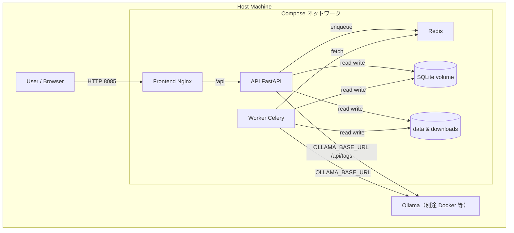
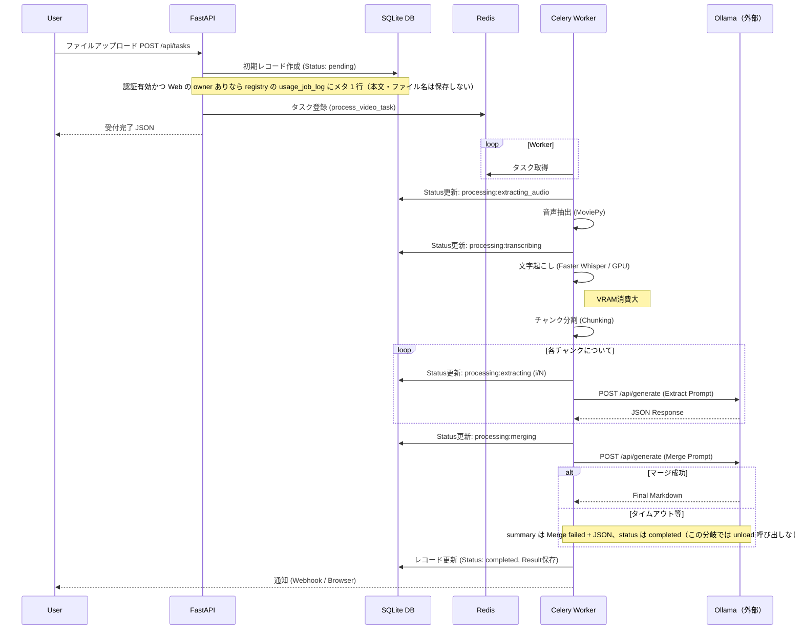

# AI議事録作成・アーカイブ 詳細アーキテクチャ設計書

> 品質確認（カバレッジ計測結果、実装・テストの対応、再現手順）は `document/coverage_report_2026-04-10.md` を参照。

## 1. システム全体構成図

本システムは、Docker Composeによってオーケストレーションされた複数のコンテナサービスで構成されます。

## 2. コンポーネント詳細

### 2.1 コンテナサービス一覧

| サービス名 | イメージ/Base | 役割 | ポート（例） | 依存関係 |
| :--- | :--- | :--- | :--- | :--- |
| **frontend** | `nginx:alpine`（ビルド成果物同梱） | React 静的配信、`/api` を API にリバースプロキシ。 | 8085→80（`MM_FRONTEND_PORT` 可変） | api |
| **api** | `python:3.11-slim` + FastAPI | DB 参照・更新、ファイル受付、Celery へタスク投入（Torch なし）。**Ollama モデル一覧**用に **`OLLAMA_BASE_URL`**（例: `http://ollama-server:11434`）へ HTTP（`/api/tags`）。**`llm-net` に参加**（ワーカーと同様、別スタックの Ollama へ到達）。**`MM_OPENAI_ENABLED`** で OpenAI 経路の可否を API レスポンス・検証に反映。 | 内部 8000 | redis |
| **worker** | `pytorch/pytorch:2.1.0-cuda12.1-cudnn8-runtime` | Whisper・MoviePy・LLM 呼び出しなど重処理。 | なし | redis |
| **redis** | `redis:alpine` | Celery ブローカー。 | 6379（内部） | なし |
| **（外部）Ollama** | 運用側で別起動 | ローカル LLM API。Compose には含めない。 | 例: ホスト 11434 | なし |

### 2.2 API コンテナ内のモジュール分割（FastAPI）

*   **`backend/main.py`**: アプリケーション生成、**CORS**、**lifespan**（起動時 DB 初期化・保持期限パージ）、各 **`APIRouter`** の `include_router` のみ。
*   **`backend/routes/`**: パス別ハンドラ（`meta` / `auth` / `admin` / `profile` / `presets` / `jobs` / `records` / `feedback`）。肥大化した単一 `main` を避け、変更箇所の特定を容易にする。
*   **共通ライブラリ（API とワーカー／Streamlit で共有しうる軽量モジュール）**:
    *   **`backend/ollama_client.py`** … Ollama のベース URL、タグ一覧取得（**api**）、**`ollama_generate_url`** と **`try_ollama_unload_model`**（**worker** の **`tasks`** が推論先 URL と VRAM 解放に利用。**`POST /api/generate` の HTTP クライアントは `tasks.call_llm` の `requests`**）
    *   **`backend/presets_io.py`** … `presets_builtin.json`（**api**・**tasks**・**app.py**）
    *   **`backend/storage.py`** … ユーザープロンプト一時保存（**api** の multipart と **Streamlit** のアップロード）
    *   **`backend/http_utils.py`** … ダウンロード応答ヘッダ等（**records** ルート）
    *   **`backend/passwords.py`** … bcrypt 検証（**auth** ルート）

### 2.3 ボリューム構成

データの永続化とコンテナ間共有のために以下のボリュームをマウントしています。

| ホストパス | コンテナパス | 用途 | 共有コンテナ |
| :--- | :--- | :--- | :--- |
| `./data` | `/app/data` | SQLite (`minutes.db`) 等。 | api, worker |
| `./downloads` | `/app/downloads` | アップロード・一時ファイル。 | api, worker |
| `./` | `/app` | ソース（開発時、主に worker のホットリロード用）。 | worker |

## 3. 処理シーケンス詳細

### 3.1 議事録作成フロー

### 3.2 状態遷移 (Status)

データベースの `status` カラムは以下の順序で遷移します。

1.  `pending`: タスク受付直後
2.  `processing:extracting_audio`: 動画から音声を抽出中
3.  `processing:transcribing`: Whisperによる文字起こし実行中
4.  `processing:extracting (N/M)`: LLMによる構造化データ抽出中（M個中N個目）
5.  `processing:merging`: 抽出データの統合と最終サマリー生成中
6.  `completed`: 全処理完了（マージのみ失敗時は **`summary` が `Merge failed` で始まる**ことがある）
7.  `cancelled`: ユーザー破棄、または **`fail()`**／外側 **`except`** による失敗（`summary` にエラー要約）

### 3.3 ワーカー主要パラメータ（設計根拠の参照先）

**Ollama `num_ctx`（既定 4096）**、**チャンク（75 秒 / 6000 文字）**、**参考資料長上限 `MM_SUPPLEMENTARY_MAX_CHARS`**、**Whisper プリセット**、**Celery 並列 1**、**GT-2222（RTX 2060 6GB 級）での指針**など、**「なぜその値か」**の根拠表とトレードオフの説明は **`document/design_spec.md` §3.1.2** を正とする。本アーキテクチャ書では実装箇所の参照のみ示す。

| 観点 | 実装の入口 |
| :--- | :--- |
| チャンク分割 | **`tasks.build_chunks_from_segments`**（`CHUNK_SEC` / `CHAR_CHUNK`） |
| Ollama オプション | **`tasks.call_llm`** → **`backend.ollama_model_profiles.resolve_ollama_options`** |
| 参考テキスト上限 | **`tasks._build_supplementary_reference_text`**（`MM_SUPPLEMENTARY_MAX_CHARS`） |
| Whisper 品質 | **`tasks.process_video_task`** 内 `whisper_preset`（`llm_config` 経由） |

## 4. データモデル設計 (Physical)

議事録本体は SQLite3（ユーザー別 **`data/user_data/.../minutes.db`** または従来 **`data/minutes.db`**）。認証有効時は **`data/registry.db`** にユーザーと利用ログを保持（**§4.1**）。

### テーブル: `records`（各 `minutes.db`）

| カラム名 | データ型 | 制約 | 説明 |
| :--- | :--- | :--- | :--- |
| **id** | TEXT | PRIMARY KEY |UUID (v4)。タスクIDと共通。 |
| **email** | TEXT | NULLABLE | 依頼者のメールアドレス（Webhook通知用）。 |
| **filename** | TEXT | | 元ファイルのファイル名（表示用）。 |
| **status** | TEXT | | 現在の処理ステータス。 |
| **transcript** | TEXT | NULLABLE | Whisperによる書き起こし全文（テキスト）。 |
| **summary** | TEXT | NULLABLE | 最終生成されたMarkdown形式の議事録、または抽出されたJSON。 |
| **created_at** | TIMESTAMP | | レコード作成日時。Pythonの `datetime.now()` で生成。 |

### 4.1 registry（`data/registry.db`、認証 `MM_AUTH_SECRET` 有効時）

ユーザー認証・OpenAI キー保存に加え、**管理者向け利用状況**用テーブルを持つ（詳細は **`document/frontend_backend_design.md` §5.2**）。

| テーブル | 説明 |
| :--- | :--- |
| `users` | ログイン ID（列名 `username`＝正規化メール）、bcrypt ハッシュ、`is_admin` |
| **`usage_job_log`** | ジョブ受付ごとに 1 行。`task_id` UNIQUE。**議事録・書き起こし本文・ファイル名文字列は保存しない**（`media_kind` は拡張子から推定）。**`input_bytes`**（受付時）および完了時メトリクス（**`media_duration_sec`**, **`whisper_wall_sec`**, **`transcript_chars`** 等。詳細は **`document/frontend_backend_design.md` §5.2**） |
| **`usage_admin_notes`** | 管理者が画面から追記する運用メモ |

API・ワーカー双方が `./data` をマウントするため、**api** が `POST /api/tasks` 受付時に書き込んだログは **registry** に永続化され、**GET `/api/admin/usage/*`** で集計される。

### 4.2 議事録レコードの保存期限と自動削除

- **`database.py`** の **`minutes_retention_days()`** が環境変数 **`MM_MINUTES_RETENTION_DAYS`** を解釈する。**未設定・非数時は `DEFAULT_MINUTES_RETENTION_DAYS`（90、約3か月）**。値が **183**（旧いちばん多かった既定）のときは **90 日として扱う**。**0 以下**で自動削除は行わない。
- **`purge_expired_minutes_db_path`**（および **`purge_expired_minutes`** / **`purge_all_minutes_archives`**）が、**`created_at` が現在より N 日より前**のレコードを対象に、**`status` が `pending` または `processing` で始まるものを除き**、関連アップロード等を掃除したうえで **DELETE** する。
- パージは **API 起動時（`backend/main.py` の lifespan）**、一覧取得前・タスク処理後など複数箇所から呼ばれる。Docker Compose では **api**・**worker** に **`MM_MINUTES_RETENTION_DAYS`** を渡し、未指定時の注入既定は **90**（**`:-90`**）。
- フロントは **`GET /api/auth/status` の `minutes_retention_days`** で UI の保存期間説明とサーバ実装を一致させる。

## 5. ネットワーク設計

*   **外部アクセス**: ホストの `MM_FRONTEND_PORT`（既定 **8085**）で Nginx＋React にアクセス。`/api` は同一オリジンで FastAPI に転送。
*   **内部通信**: Compose 既定ネットワーク上でサービス名で名前解決。**api** と **worker** の両方が追加で外部ネットワーク **`llm-net`** に参加し、別スタックの Ollama（例: `ollama-server`）と同一 L2 で通信する。
    *   API → Redis: `redis:6379`
    *   Worker → Redis: `redis:6379`
    *   API → Ollama: **`OLLAMA_BASE_URL`** の **`GET /api/tags`**（タグ名一覧。UI のモデル候補用。ブラウザは Ollama に直結しない）
    *   Worker → Ollama: **`OLLAMA_BASE_URL`**（推論は **`tasks.call_llm`** が **`requests.post(ollama_generate_url(), …)`**。**`options.num_ctx: 4096`**・**`timeout=600`** はコード固定）。**`try_ollama_unload_model`** で **`keep_alive: 0`** を送り得る（**`OLLAMA_UNLOAD_ON_TASK_END`** で無効化可）。**破棄／fail／未捕捉例外後**。**マージ `Merge failed` フォールバック時はアンロードなし**
*   **機能フラグ**: リポジトリ直下の **`feature_flags.py`** が **`MM_OPENAI_ENABLED`** を解釈し、API・Celery・Streamlit で共通利用する。

### 5.1 HTTPS + サブパス公開（GT-2222 運用）

- **GPU 代表構成（RTX 2060 6GB 級）**での Ollama **`num_ctx`**・チャンク・参考資料上限の指針は **`document/design_spec.md` §3.1.2**（本サーバは **VRAM 6GB** を前提に **4096 維持推奨**など）。
- 外部公開はホスト Nginx で TLS 終端し、`/meetingminutesnotebook/` を `http://127.0.0.1:8085/meetingminutesnotebook/` にリバースプロキシする。
- Compose の `.env` は以下を必須とする。
  - `VITE_BASE_PATH=/meetingminutesnotebook/`
  - `VITE_API_BASE=/meetingminutesnotebook`
  - `MM_CORS_ORIGINS` に `https://gt-2222`
- フロントコンテナ Nginx はサブパス受信時にプレフィックスを剥がして静的配信へ解決する（rewrite + `/index.html` fallback）。
- **ホスト443の証明書**: `ssl_certificate` / `ssl_certificate_key` には **ルートCAで署名した `gt-2222.crt` / `gt-2222.key`** を指定する。`issuer=subject=gt-2222` の単体自己署名を出し続けると、クライアントに配った `rootCA.crt` と鎖がつながらない。
- **同一 `server { listen 443 ssl; server_name GT-2222; }`** では、`/jupyter/` 等の他 `location` も **同じサーバ証明書**を使う（TLS は `server` 単位）。
- 代表ヘルス確認:
  - `curl -sI http://127.0.0.1:8085/meetingminutesnotebook/`
  - `curl -skI --resolve gt-2222:443:127.0.0.1 https://gt-2222/meetingminutesnotebook/`
  - `openssl s_client` で提示証明書の **issuer（ルートCA）** と **SAN（DNS:gt-2222）** を確認
- 運用時の詳細トラブルシュートは `document/gt2222_https_subpath_troubleshooting.md` を参照。

## 6. セキュリティと制約事項

*   **認証**: 環境変数 `MM_AUTH_SECRET` 設定時に **JWT（Bearer）＋ registry DB** によるログインを有効化。`data/registry.db` の `users` テーブルにパスワードハッシュ（bcrypt）と `is_admin` を保持。ログイン ID は **メールアドレス**（DB 主キー列名は `username`）。ユーザーが 0 件の初回のみ、ブラウザの **初回セットアップ**（または `MM_BOOTSTRAP_ADMIN_*`）で最初の管理者を登録可能。管理者は **設定ドロワーの「ユーザー・権限」タブ**から追加ユーザー・パスワード再設定・管理者権限の付与・解除が可能。**「利用ログ画面」**では **`usage_job_log`** の集計（**最大 365 日**、**議事録・書き起こし本文は含まない**）・**メトリクス（入力サイズ・処理時間・文字数等）**と **`usage_admin_notes`** の編集が可能（**§4.1**・**`frontend_backend_design.md` §5.2**）。議事録本体はユーザー別に `data/user_data/<slug>/minutes.db`（従来は `data/minutes.db`）。
*   **秘密情報と設定の所在（外部流出防止）**: **JWT 署名鍵・TTL・自己登録可否**は `backend/auth_settings.py` が環境変数（`MM_AUTH_SECRET` 等）から読み取る。**CORS**は `backend/main.py`（**HTTP ハンドラ本体**は `backend/routes/`）。**registry を認証前提とするか**は `database.py` が `MM_AUTH_SECRET` の有無で判定。これらの**秘密鍵・パスワード・利用者 API キー**をフロントの `VITE_*` やリポジトリ・スクリーンショットに含めないこと。詳細な区分（何が秘密か、ポートは秘密ではないか、チェックリスト）は **`document/frontend_backend_design.md` §7.1〜7.4** に明記する。
*   **同時実行数**: Celery Workerの `concurrency` は **1** に設定。GPUメモリ制限のため、複数の重量級タスク（Whisper/LLM）の並列実行は行わない（**`design_spec.md` §3.1.2**）。
*   **データ保護**: データはローカルボリュームに保存され、外部クラウドには送信されない。
*   **議事録 DB の保存期限**: **`MM_MINUTES_RETENTION_DAYS`**（詳細は **§4.2**）。既定 **90 日**。詳細な環境変数一覧は **`document/frontend_backend_design.md` §7.1** を参照。

---
*Last Updated: 2026-04-03（**§3.3** 追加: パラメータ根拠は `design_spec.md` §3.1.2 へ集約。§6 並列度に相互参照）*
