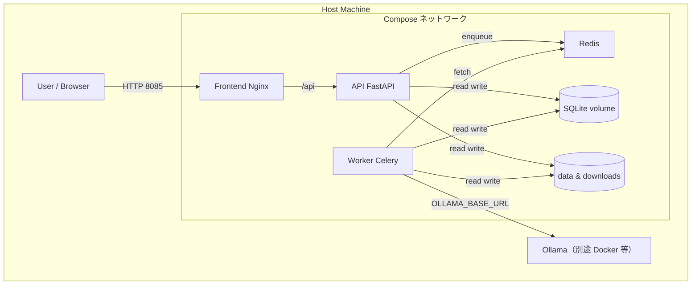
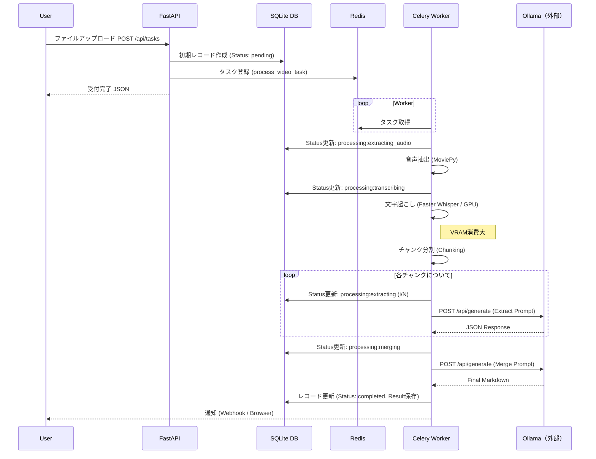

# AI議事録作成・アーカイブ 詳細アーキテクチャ設計書

## 1. システム全体構成図

本システムは、Docker Composeによってオーケストレーションされた複数のコンテナサービスで構成されます。

## 2. コンポーネント詳細

### 2.1 コンテナサービス一覧

| サービス名 | イメージ/Base | 役割 | ポート（例） | 依存関係 |
| :--- | :--- | :--- | :--- | :--- |
| **frontend** | `nginx:alpine`（ビルド成果物同梱） | React 静的配信、`/api` を API にリバースプロキシ。 | 8085→80（`MM_FRONTEND_PORT` 可変） | api |
| **api** | `python:3.11-slim` + FastAPI | DB 参照・更新、ファイル受付、Celery へタスク投入（Torch なし）。 | 内部 8000 | redis |
| **worker** | `pytorch/pytorch:2.1.0-cuda12.1-cudnn8-runtime` | Whisper・MoviePy・LLM 呼び出しなど重処理。 | なし | redis |
| **redis** | `redis:alpine` | Celery ブローカー。 | 6379（内部） | なし |
| **（外部）Ollama** | 運用側で別起動 | ローカル LLM API。Compose には含めない。 | 例: ホスト 11434 | なし |

### 2.2 ボリューム構成

データの永続化とコンテナ間共有のために以下のボリュームをマウントしています。

| ホストパス | コンテナパス | 用途 | 共有コンテナ |
| :--- | :--- | :--- | :--- |
| `./data` | `/app/data` | SQLite (`minutes.db`) 等。 | api, worker |
| `./downloads` | `/app/downloads` | アップロード・一時ファイル。 | api, worker |
| `./` | `/app` | ソース（開発時、主に worker のホットリロード用）。 | worker |

## 3. 処理シーケンス詳細

### 3.1 議事録作成フロー

### 3.2 状態遷移 (Status)

データベースの `status` カラムは以下の順序で遷移します。

1.  `pending`: タスク受付直後
2.  `processing:extracting_audio`: 動画から音声を抽出中
3.  `processing:transcribing`: Whisperによる文字起こし実行中
4.  `processing:extracting (N/M)`: LLMによる構造化データ抽出中（M個中N個目）
5.  `processing:merging`: 抽出データの統合と最終サマリー生成中
6.  `completed`: 全処理完了
7.  `Error: <message>`: 処理中に例外が発生した場合

## 4. データモデル設計 (Physical)

SQLite3 (`data/minutes.db`) を使用。

### テーブル: `records`

| カラム名 | データ型 | 制約 | 説明 |
| :--- | :--- | :--- | :--- |
| **id** | TEXT | PRIMARY KEY |UUID (v4)。タスクIDと共通。 |
| **email** | TEXT | NULLABLE | 依頼者のメールアドレス（Webhook通知用）。 |
| **filename** | TEXT | | 元ファイルのファイル名（表示用）。 |
| **status** | TEXT | | 現在の処理ステータス。 |
| **transcript** | TEXT | NULLABLE | Whisperによる書き起こし全文（テキスト）。 |
| **summary** | TEXT | NULLABLE | 最終生成されたMarkdown形式の議事録、または抽出されたJSON。 |
| **created_at** | TIMESTAMP | | レコード作成日時。Pythonの `datetime.now()` で生成。 |

## 5. ネットワーク設計

*   **外部アクセス**: ホストの `MM_FRONTEND_PORT`（既定 **8085**）で Nginx＋React にアクセス。`/api` は同一オリジンで FastAPI に転送。
*   **内部通信**: Compose 既定ネットワーク上でサービス名で名前解決。**worker** は追加で外部ネットワーク **`llm-net`** に参加し、別スタックの Ollama（例: `ollama-server`）と同一 L2 で通信する。
    *   API → Redis: `redis:6379`
    *   Worker → Redis: `redis:6379`
    *   Worker → Ollama: **`OLLAMA_BASE_URL`**（Compose 既定は **`http://ollama-server:11434`**。コンテナ名・URL が違えば `.env` で指定）

## 6. セキュリティと制約事項

*   **認証**: 環境変数 `MM_AUTH_SECRET` 設定時に **JWT（Bearer）＋ registry DB** によるログインを有効化。`data/registry.db` の `users` テーブルにパスワードハッシュ（bcrypt）と `is_admin` を保持。ログイン ID は **メールアドレス**（DB 主キー列名は `username`）。ユーザーが 0 件の初回のみ、ブラウザの **初回セットアップ**（または `MM_BOOTSTRAP_ADMIN_*`）で最初の管理者を登録可能。管理者は **設定ドロワーの「ユーザー・権限」タブ**から追加ユーザー・パスワード再設定・管理者権限の付与・解除が可能。議事録本体はユーザー別に `data/user_data/<slug>/minutes.db`（従来は `data/minutes.db`）。
*   **秘密情報と設定の所在（外部流出防止）**: **JWT 署名鍵・TTL・自己登録可否**は `backend/auth_settings.py` が環境変数（`MM_AUTH_SECRET` 等）から読み取る。**CORS**は `backend/main.py`。**registry を認証前提とするか**は `database.py` が `MM_AUTH_SECRET` の有無で判定。これらの**秘密鍵・パスワード・利用者 API キー**をフロントの `VITE_*` やリポジトリ・スクリーンショットに含めないこと。詳細な区分（何が秘密か、ポートは秘密ではないか、チェックリスト）は **`document/frontend_backend_design.md` §7.1〜7.4** に明記する。
*   **同時実行数**: Celery Workerの `concurrency` は **1** に設定。GPUメモリ制限のため、複数の重量級タスク（Whisper/LLM）の並列実行は行わない。
*   **データ保護**: データはローカルボリュームに保存され、外部クラウドには送信されない。

---
*Last Updated: 2026-03-23（§6 に秘密情報のコード所在と設計書参照を追加。ログイン ID をメールに合わせて記述）*
