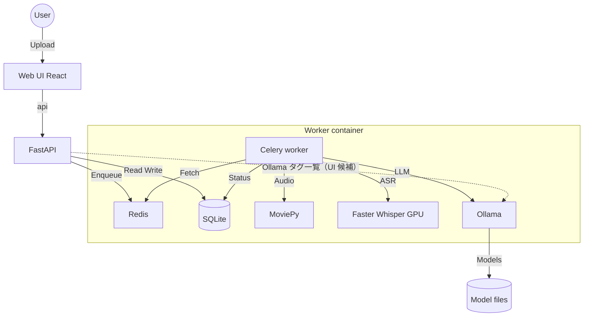

# AI議事録作成・アーカイブ (AI Minutes Archive) 基本設計書

## 1. はじめに

### 1.1 目的
本システムは、社内会議の動画・音声ファイルをAIを用いて自動的に文字起こし・要約し、構造化された議事録としてアーカイブすることを目的とする。これにより、議事録作成の工数削減と、情報の透明性・検索性の向上を図る。

### 1.2 背景
従来の議事録作成は手作業に依存しており、担当者の負担が大きく、品質にもばらつきがあった。また、作成されたファイルが各個人のPCに散在し、情報共有がスムーズに行われないという課題があった。本システムはこれらの課題を解決するための社内ツールである。

### 1.3 品質エビデンス参照
実装とテストの対応、および計測コマンド/手順を含むカバレッジ報告は `document/coverage_report_2026-04-10.md` を正本として参照する。

## 2. システム概要

### 2.1 機能一覧
| カテゴリ | 機能名 | 説明 |
| :--- | :--- | :--- |
| **ユーザー** | ファイルアップロード | 動画(mp4, m4a)・音声(mp3, wav)ファイルをドラッグ&ドロップでアップロード可能。 |
| | タスク状況確認 | 処理中のタスク（文字起こし中、要約中など）の進捗状況をプログレスバーで表示。 |
| | 議事録閲覧 | 作成完了した議事録をWebブラウザ上で閲覧可能。 |
| | ダウンロード | 議事録(Markdown形式)および全文テキスト(Text形式)をダウンロード可能。 |
| | 通知設定 | 完了通知をブラウザ通知、Webhook（Slack/Chatwork 等）、または **SMTP 設定時はメール**で受け取り可能。 |
| **AI処理** | 自動文字起こし | Whisperモデルを使用し、高精度な音声認識を行う。 |
| | 構造化要約 | **Ollama**（モデル名はユーザー指定。既定例: qwen2.5:7b）または **OpenAI API**（環境・認証設定に応じて）で、決定事項・課題・アクション・メモに自動分類・整理する。 |
| | **Ollama モデル候補** | API が `OLLAMA_BASE_URL` の Ollama **`/api/tags`** を中継し、フロントは一覧を **`<select>`（候補のみ）**で表示。ブラウザから Ollama へ直アクセスしない。 |
| | **OpenAI 機能フラグ** | 環境変数 **`MM_OPENAI_ENABLED`**（`feature_flags.py`）で OpenAI 連携をオフにできる。オフ時は UI・API とも OpenAI 経路を使わず Ollama のみ（課金 API の無効化・既定 Docker 向け）。 |
| **管理** | 履歴管理 | 過去の議事録をデータベースで一元管理。**サーバは環境変数 `MM_MINUTES_RETENTION_DAYS`（既定 90 日≒約3か月）に基づき、古いレコードを自動削除**（待機・処理中は除く）。React は **`/api/auth/status` の `minutes_retention_days`** を使い、アーカイブ見出し下に保存期間を表示。 |
| | 自動クリーンアップ | 処理パイプライン完了後の**中間ファイル**（抽出音声・動画等）の削除に加え、**期限切れ議事録レコード**と関連アップロードの削除（**`database.py` の purge**。詳細は **`document/frontend_backend_design.md` §7.1**）。 |
| | **利用状況ログ（管理者）** | **`MM_AUTH_SECRET` 有効時**、管理者のみ設定の **「利用状況」** でジョブ投入の集計を閲覧。**議事録本文・書き起こし・ファイル名は記録しない**（メタデータと拡張子由来の媒体種別のみ）。**完了ジョブ**については入力サイズ・媒体の長さ・Whisper／議事録 LLM の壁時計・書き起こし文字数などの**メトリクス**を参照可能（サーバ強化・稟議の根拠用。サマリの **`metrics_rollup`** は **`transcript_chars` 記録済み行**に限定）。集計期間 **最大 365 日**。Ollama/OpenAI ごとの **モデル別内訳**、運用メモの CRUD。詳細は **`document/frontend_backend_design.md` §5.2**。 |
| **認証** | 初回セットアップ | `MM_AUTH_SECRET` 有効時、ユーザー 0 件なら Web で最初の管理者（**メールアドレス・パスワード**）を登録。 |
| | ログイン | JWT（Bearer）。以降 API は認証ユーザーに紐づく議事録 DB を使用。 |
| | ユーザー・権限管理 | 管理者のみ：設定ドロワー内の専用タブでユーザー追加、パスワード再設定、管理者権限の付与・解除、削除（最後の管理者は保護）。 |

### 2.2 システムアーキテクチャ

本システムは、Dockerコンテナ上で動作する マイクロサービス構成に近いアーキテクチャを採用している。



### 2.3 使用技術スタック
*   **Frontend（本番・推奨）**: React + Vite + TypeScript（Nginx 静的配信、`document/frontend_backend_design.md` 参照）
*   **Frontend（レガシー）**: Streamlit（`app.py`。ローカル検証・従来 Dockerfile 単体起動向け）
*   **Backend Task Queue**: Celery
*   **Message Broker**: Redis
*   **Database**: SQLite (簡易実装、将来的なPostgreSQL移行を考慮)
*   **AI Engine**:
    *   ASR (Speech-to-Text): faster-whisper (Compute Type: float16, Device: CUDA)
    *   LLM (Summarization): Ollama (Model: qwen2.5:7b)
*   **Infrastructure**: Docker, NVIDIA Container Toolkit

## 3. データフロー設計

### 3.1 議事録作成パイプライン
処理は以下のステップで実行される。

1.  **受付**: ユーザーがファイルをアップロードし、UUIDが発行される。
2.  **音声抽出**: `moviepy` を使用して、動画ファイルから音声(MP3)を抽出。
3.  **文字起こし**: `faster-whisper` により音声データをテキスト化。タイムスタンプ付きのセグメントデータ (`segments`) を生成。
4.  **チャンク分割**: タイムスタンプが有効なセグメントは **約 75 秒**ごとに結合。無効（プレーンテキスト等）は **約 6000 文字**ごと（**§3.1.2**）。
5.  **情報抽出 (Map)**: 各チャンクに対してLLM (Ollama) を実行し、以下の要素をJSON形式で抽出。
    *   決定事項 (Decisions)
    *   課題 (Issues)
    *   アクションアイテム (Items/Actions)
    *   重要メモ (Notes)
6.  **統合 (Reduce)**: 全チャンクの抽出結果をマージし、再度LLMを実行して重複排除・文章の整形で最終的なMarkdown議事録を生成。Ollama がタイムアウト等で失敗した場合は **`summary` が `Merge failed (Error: …)` で始まり続けて抽出 JSON** となり、**`status` は `completed`** のまま（**`try_ollama_unload` はこの経路では呼ばれない**）。
7.  **完了・通知**: データベースを更新し、Webhookまたはブラウザ経由でユーザーに完了を通知。

#### 3.1.1 Ollama 呼び出しパラメータ（ワーカー・CLI）

- **Celery ワーカー**（**`tasks.call_llm`**）は **`requests.post`** で **`backend/ollama_client.ollama_generate_url()`**（**`POST /api/generate`**）へ送る。**`options.num_ctx: 4096`**・**`timeout=600`** は **コード内固定**（環境変数 `OLLAMA_NUM_CTX` 等は未使用）。
- **VRAM 早期解放**: **`backend/ollama_client.try_ollama_unload_model`**（**`keep_alive: 0`**）。**`tasks`** の **破棄掃除・`fail`・外側 `except`** から **`_try_ollama_unload_for_config`** 経由で呼ぶ。**`OLLAMA_UNLOAD_ON_TASK_END`** が **`0`/`false`/`no`** ならスキップ。OpenAI 経路ではスキップ。**マージのみ失敗**（`Merge failed` フォールバック）では **呼ばない**。
- **CLI パイプライン**: **`pipeline/02_extract.py`** はローカル **`_ollama_generate_url`** と **`extract_json_block`**。**`03_merge.py`** は **`NUM_CTX=4096`**, **`REQ_TIMEOUT=600`**。ワーカーと値は揃えるが **コード共通化モジュールはない**。

#### 3.1.2 主要パラメータの選定根拠（ワーカー・Ollama・チャンク・参考資料）

本節は **「なぜ現在の既定値か」** を運用・ハードウェア制約と結びつけて記す。実装の単一ソースは **`tasks.py`**・**`backend/ollama_model_profiles.py`**・**`backend/storage.py`**・**`pipeline/01_chunk.py`**（CLI 用。`CHUNK_SEC` はワーカーと同値に揃えること）。

| 項目 | 既定・所在 | 根拠 |
| :--- | :--- | :--- |
| **`options.num_ctx`（Ollama）** | **4096**。`backend/ollama_model_profiles.py` の **`DEFAULT_OPTIONS`**。ワーカーは **`tasks.call_llm`** → **`resolve_ollama_options`** でマージ。 | **llama.cpp 系の KV キャッシュはコンテキスト長に概ね比例**し、VRAM を圧迫する。同一マシンで **faster-whisper（GPU）の後に 7B 級を載せる**前提では、4096 を安全側の出発点とした。**以前は 8192 を採用していたが、VRAM／KV 負荷・CPU オフロード時の負担抑制のため 4096 に引き下げ**（`frontend_backend_design.md` 変更履歴 1.15 参照）。モデルが長文でも **`num_ctx` を超えたトークンはモデル実装側で扱われず切り捨てられうる**ため、チャンク・参考資料と **トレードオフ**になる。 |
| **`num_ctx` の上書き** | 環境変数ではなく **`MM_OLLAMA_PROFILES_PATH`** の JSON（**`config/ollama_profiles.example.json`** 参照）。`match` でモデル名プレフィックス一致。 | 機種・VRAM ごとに **同一コードで切り替え**できるようにする。例: VRAM に余裕がある環境だけ **8192** を試す。 |
| **Ollama HTTP 読み取りタイムアウト** | **600 秒**。`tasks.call_llm` の `requests`。 | **マージ**は結合 JSON＋指示文が長く、応答も長くなりやすい。短いタイムアウトは失敗率を上げる。 |
| **`CHUNK_SEC`** | **75**（秒）。`tasks.build_chunks_from_segments`。 | **会話のまとまり**と **1 回の LLM 呼び出しの入力サイズ**のバランス。秒数を **大きく**するとチャンク数は減るが、**1 プロンプトが `num_ctx` を食いやすい**。秒数を **小さく**すると呼び出し回数・オーバーヘッドが増える。 |
| **`CHAR_CHUNK`** | **6000**（文字）。タイム分割を使わない経路のみ。 | プレーンテキスト等で **セグメントの時間幅が実質ない**場合に、時間分割の代わりに **文字数で近似**する。全文が `CHAR_CHUNK` 以下なら **チャンク 1 個**。 |
| **時間チャンクへの切替条件** | いずれかのセグメントで **`end - start > 0.5`（秒）** | Whisper・SRT 等は **時間ベース**、平文は **文字ベース**に振り分けるためのヒューリスティック。 |
| **`MM_SUPPLEMENTARY_MAX_CHARS`** | 既定 **120000**。ワーカーが **`tasks` import 時**に環境変数を読む（**変更後はワーカー再起動**）。 | **Teams トランスクリプト・担当メモ**を結合した参考テキストの上限。**過大**にすると抽出プロンプトが **`num_ctx` と競合**しやすく、遅延・失敗・無視されやすい末尾が増える。**Teams を先・メモを後**で連結するため、上限超過時は **メモ側が先に落ちる**ことがある。 |
| **参考資料のプロンプト埋め込み** | `{SUPPLEMENTARY_REFERENCE}`（**`prompts/prompt_extract.txt` / `prompt_merge.txt`**）。カスタムプロンプトに無い場合は **`tasks`** が **`{CHUNK_TEXT}` 直前**または **`{EXTRACTED_JSON}` 直後**へ自動挿入。 | 運用でテンプレを差し替えても破綻しにくくする。 |
| **`whisper_preset`（`fast` / `balanced` / `accurate`）** | UI・`metadata` で指定。既定 **`accurate`**。 | **認識品質と処理時間・GPU 負荷**のトレードオフ。議事録用途では **誤変換抑制**を既定で優先。`.txt`/`.srt` 直投入では未使用。 |
| **Celery Worker の並列度** | 例: **`concurrency=1`**（Compose 運用） | **GPU VRAM**。Whisper と LLM を **複数ジョブで同時に積む**構成は想定外。 |
| **代表運用環境（GT-2222）** | **RTX 2060 6GB 級**を想定したときの指針 | **物理 VRAM は省電力・クロック系ツールでは増えない**。**6GB + qwen2.5:7b では `num_ctx` 4096 維持を推奨**し、**8192 は OOM・不安定のリスクが高め**。余裕がある GPU（例: 12GB 以上）では **`MM_OLLAMA_PROFILES_PATH` で 8192 を試す**余地がある。 |

**注意**: 「モデル公式の最大コンテキスト（例: 32k トークン級）」と「**自前 GPU で快適に回す `num_ctx`**」は一致しない。後者は **KV の VRAM 消費**と **1 ジョブあたりのプロンプト実長**で決める。

### 3.2 データベース設計 (簡易スキーマ)

**議事録 `records`（各 `minutes.db`）**
| カラム名 | 型 | 説明 |
| :--- | :--- | :--- |
| `id` | TEXT (PK) | タスク固有のUUID |
| `email` | TEXT | 依頼者のメールアドレス |
| `filename` | TEXT | アップロードされたファイル名 |
| `status` | TEXT | 現在のステータス (queued, processing:..., completed, error) |
| `transcript` | TEXT | 文字起こし全文 |
| `summary` | TEXT | 最終的な議事録データ (JSON/Markdown) |
| `created_at` | TIMESTAMP | 作成日時 |

**registry（認証有効時・`data/registry.db`）**

| テーブル | 用途 |
| :--- | :--- |
| `users` | ログイン ID（`username`＝正規化メール）、パスワードハッシュ、`is_admin` |
| **`usage_job_log`** | **利用状況集計用**。ジョブ受付時に 1 行（`task_id` 一意）。**議事録・書き起こし本文・ファイル名文字列は保持しない**。受付時 **`input_bytes`**、完了時 **媒体の長さ・音声抽出／Whisper／LLM の壁時計・書き起こし文字数**等（**`database.update_usage_job_metrics`**。列一覧は **`document/frontend_backend_design.md` §5.2**） |
| **`usage_admin_notes`** | 管理者が追記する運用メモ（経営・インフラ訴求用など） |

スキーマ・記録条件の詳細は **`document/frontend_backend_design.md` §5.2**。

## 4. インターフェース設計

### 4.1 画面構成（React + FastAPI 構成時）
1.  **認証**（`MM_AUTH_SECRET` 設定時）
    *   初回: 初回セットアップ（管理者ユーザー・パスワード）
    *   2 回目以降: ログイン
    *   管理者: 右上アイコンメニューから「ユーザー・権限管理」「**利用ログ画面**」→ 管理者専用のログ画面で **利用集計（最大 365 日）・メトリクス（負荷・容量の目安）・運用メモ**
2.  **サイドバー (左側)**
    *   新規解析依頼フォーム（**通知**: ブラウザ / Webhook / **メール（SMTP 設定時）** / なし、ファイルアップローダー）
    *   **書き起こしのみ**（チェック時は Whisper または .txt/.srt のみ。議事録用 LLM は使わない）
    *   **解析設定**: **音声認識の品質（Whisper）** — `whisper_preset`（`fast` / `balanced` / `accurate`）を **`<select>`** で指定。説明ツールチップあり
    *   **AI の接続先**: ローカル（Ollama）または OpenAI（`MM_OPENAI_ENABLED` がオンのときのみ UI 表示。オフ時は Ollama のみ・説明文のみ）
    *   **Ollama モデル**: `GET /api/ollama/models` で取得したタグを候補にした **`<select>`**（手入力不可。選択後は `blur` でフォーカスリングを外しやすくしている）
    *   **OpenAI**: 認証有効時は **設定ドロワー／一般**でサーバ（registry）に API キー・モデルを保存し、投入時はそのキーを使用。認証オフ時のみフォームからキーを送るモード
3.  **メインエリア (右側)**
    *   **ヘッダー**: タイトル・**ヘルプ**（`#help`）・右上アカウントアイコン（ドロップダウン：ヘルプ・設定・ユーザー権限・サインアウト等）
    *   **議事録アーカイブ**: 見出しの**下**に、サーバから取得した **保存期間・自動削除**の説明を表示
    *   **議事録一覧**: 直近の履歴をエクスパンダー形式でリスト表示。
        *   展開時: プレビュー／編集／書き起こし、ダウンロードボタン

### 4.2 秘密情報と設定（外部に出さないこと）

*   **JWT 署名鍵**（`MM_AUTH_SECRET`）、**ブートストラップ用パスワード**（`MM_BOOTSTRAP_ADMIN_PASSWORD`）、**利用者の OpenAI API キー**（`registry.db` 保存分）は、リポジトリ・静的フロントのビルド成果物・スクリーンショット・公開ログに含めない。
*   **`VITE_*` 環境変数**はクライアント JS に埋め込まれるため、上記の秘密を渡さない（API の公開 URL のみ）。
*   ポート番号や CORS オリジンは「秘密」ではないが、**不要な外向き公開**は避ける。
*   コード上の所在、禁止事項、リリース前チェックリストの詳細は **`document/frontend_backend_design.md` の §7.1〜7.4** を参照する。

### 4.3 出力フォーマット (Markdown)
```markdown
#### 決定事項
- [決定内容] (根拠/発言者)

#### 課題
- [課題内容]

#### アクション
- [ ] **[担当者]**: [タスク内容] (期限: [期限])

#### 重要メモ
- [メモ内容]
```

## 5. デプロイ要件

*   **OS**: Linux または Windows (WSL2推奨)
*   **コンテナランタイム**: Docker Engine
*   **GPU**: NVIDIA GPU (CUDA対応) 必須
    *   VRAM: 8GB以上推奨 (Whisper Medium + Qwen2.5 7Bの同時稼働のため)
*   **ドライバ**: NVIDIA Driver, NVIDIA Container Toolkit

### 5.1 GT-2222 公開時の必須設定（HTTPS + サブパス）

- 公開URL: `https://gt-2222/meetingminutesnotebook/`
- リポジトリ直下 `.env`（`docker-compose.yml` と同階層）に以下を設定する。
  - `VITE_BASE_PATH=/meetingminutesnotebook/`
  - `VITE_API_BASE=/meetingminutesnotebook`
  - `MM_CORS_ORIGINS` に `https://gt-2222`（パスなし）
- フロントは `docker compose build frontend --no-cache` で再ビルドして反映する。
- **TLS（社内ルートCAでサーバ証明書を発行する運用）**
  - ホストNginx: `ssl_certificate` / `ssl_certificate_key` は **`gt-2222.crt`（ルートCA署名）** と **`gt-2222.key`**。古い **`selfsigned.crt`（issuer=subject=gt-2222 等）** のままだと、クライアントに `rootCA.crt` を入れてもブラウザは信頼しない。
  - サーバで `openssl s_client` により **issuer がルートCA**、**SAN に DNS:gt-2222** であることを確認してからクライアント対応に進む。
  - **Windows**: 証明書インポートウィザードで **「自動でストアを選択」だけにしない**。**「証明書をすべて次のストアに配置する」→「信頼されたルート証明機関」** を明示。インポート対象は **`rootCA.crt` のみ**（`rootCA.key` は配布しない）。完了後は Edge 完全終了→再アクセス。
- **ブラウザ通知**: 完了通知を「ブラウザ」で受け取る場合、初回などに **通知の許可** を求めるポップアップが出たら **許可**する。サイト別の通知設定でブロックされていないことも確認する。
- 詳細な失敗パターンと切り分け手順は `document/gt2222_https_subpath_troubleshooting.md` を参照。

## 6. 付録：ディレクトリ構成
*   `frontend/`: React（Vite）SPA。本番ビルドは Nginx 経由で配信。
*   `backend/main.py`: FastAPI の**組み立てのみ**（CORS・lifespan・`include_router`）。エンドポイント実装は持たない。
*   `backend/routes/`: **ドメイン別 APIRouter**（実装の見通し用に分割）
    *   `meta.py` … ヘルス・版情報・Ollama タグ一覧
    *   `auth.py` … 認証状態・ログイン・初回セットアップ・自己登録・`/auth/me`
    *   `admin.py` … 管理者ユーザー CRUD、**`/api/admin/usage/*`**（利用サマリ・イベント・メモ）
    *   `profile.py` … `/me/llm`（OpenAI 設定）
    *   `presets.py` … プリセット JSON 配信
    *   `jobs.py` … `POST /tasks`（Celery 投入）
    *   `records.py` … 一覧・キュー・1件・破棄・エクスポート・summary PATCH
*   `backend/schemas.py`, `backend/deps.py`: Pydantic スキーマ・FastAPI 依存（JWT 管理者等）
*   `backend/ollama_client.py`: **`OLLAMA_BASE_URL`** 解決、**`/api/tags`**、**`ollama_generate_url`**、**`try_ollama_unload_model`**（**`tasks`** が推論 URL とアンロードに利用。推論の **`requests.post` 本体は `tasks.call_llm`**）
*   `backend/presets_io.py`: **`presets_builtin.json`** の読込（**`GET /api/presets`** と **Streamlit `app.py`**・**`tasks.py`** のプリセットで共通化）。**`design_review`（設計書レビュー）** プリセットは設計レビュー向けの抽出・統合ヒント用。**手動のレビュー記録テンプレ**は **`document/design_review_template.md`**
*   `backend/http_utils.py`: エクスポート用 **Content-Disposition**、SQLite 行の **dict 化**
*   `backend/passwords.py`: ログイン時の **bcrypt 検証**
*   `backend/storage.py`: ユーザープロンプト・**参考資料（Teams/メモ）**一時保存（**`merge_task_prompt_paths`** 等。**API** と **Streamlit**）
*   `feature_flags.py`: **`MM_OPENAI_ENABLED`** 等の機能 ON/OFF（API・ワーカー・`app.py` で共通化）
*   `app.py`: Streamlit（レガシー UI。プリセット・プロンプト保存は **`backend.presets_io`** / **`backend.storage`** で API と整合）
*   `tasks.py`: Celery ワーカー（**`@celery_app.task`** の **`process_video_task`**）。**`call_llm`** が Ollama 時 **`requests.post`**（**`ollama_generate_url`**、**`num_ctx` 4096**、**timeout 600**）。**`extract_json_block`** は本モジュール内関数。**`backend.ollama_client`** の **`try_ollama_unload_model`** をエラー／破棄時に利用（§3.1.1）
*   `celery_app.py`: Celery アプリ定義（API はここだけ import して `send_task`）
*   `database.py`: DB 操作ラッパー（認証時は **`registry.db`**（ユーザー・**`usage_job_log` / `usage_admin_notes`**）・ユーザー別 `minutes.db`）
*   `pipeline/`: ローカル実行用スクリプト群
*   `prompts/prompt_extract.txt`, `prompts/prompt_merge.txt`: プロンプトテンプレート

---
*Last Updated: 2026-04-03（§3.1.2 パラメータ根拠・付録に **`design_review` プリセット**・**`document/design_review_template.md`**）*
