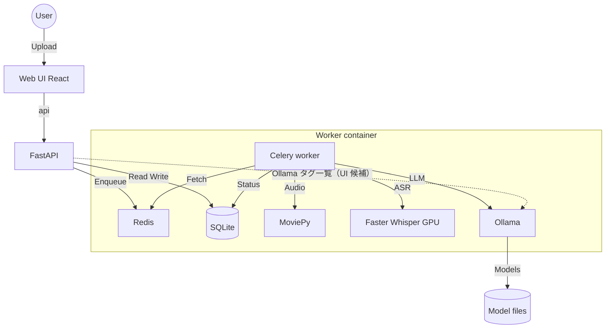

# AI議事録作成・アーカイブ (AI Minutes Archive) 基本設計書

## 1. はじめに

### 1.1 目的
本システムは、社内会議の動画・音声ファイルをAIを用いて自動的に文字起こし・要約し、構造化された議事録としてアーカイブすることを目的とする。これにより、議事録作成の工数削減と、情報の透明性・検索性の向上を図る。

### 1.2 背景
従来の議事録作成は手作業に依存しており、担当者の負担が大きく、品質にもばらつきがあった。また、作成されたファイルが各個人のPCに散在し、情報共有がスムーズに行われないという課題があった。本システムはこれらの課題を解決するための社内ツールである。

## 2. システム概要

### 2.1 機能一覧
| カテゴリ | 機能名 | 説明 |
| :--- | :--- | :--- |
| **ユーザー** | ファイルアップロード | 動画(mp4, m4a)・音声(mp3, wav)ファイルをドラッグ&ドロップでアップロード可能。 |
| | タスク状況確認 | 処理中のタスク（文字起こし中、要約中など）の進捗状況をプログレスバーで表示。 |
| | 議事録閲覧 | 作成完了した議事録をWebブラウザ上で閲覧可能。 |
| | ダウンロード | 議事録(Markdown形式)および全文テキスト(Text形式)をダウンロード可能。 |
| | 通知設定 | 完了通知をブラウザ通知、Webhook（Slack/Chatwork 等）、または **SMTP 設定時はメール**で受け取り可能。 |
| **AI処理** | 自動文字起こし | Whisperモデルを使用し、高精度な音声認識を行う。 |
| | 構造化要約 | **Ollama**（モデル名はユーザー指定。既定例: qwen2.5:7b）または **OpenAI API**（環境・認証設定に応じて）で、決定事項・課題・アクション・メモに自動分類・整理する。 |
| | **Ollama モデル候補** | API が `OLLAMA_BASE_URL` の Ollama **`/api/tags`** を中継し、フロントは一覧を **`<select>`（候補のみ）**で表示。ブラウザから Ollama へ直アクセスしない。 |
| | **OpenAI 機能フラグ** | 環境変数 **`MM_OPENAI_ENABLED`**（`feature_flags.py`）で OpenAI 連携をオフにできる。オフ時は UI・API とも OpenAI 経路を使わず Ollama のみ（課金 API の無効化・既定 Docker 向け）。 |
| **管理** | 履歴管理 | 過去の議事録をデータベースで一元管理。 |
| | 自動クリーンアップ | 処理完了後の中間ファイル（音声・動画）を自動削除し、ストレージを節約。 |
| **認証** | 初回セットアップ | `MM_AUTH_SECRET` 有効時、ユーザー 0 件なら Web で最初の管理者（**メールアドレス・パスワード**）を登録。 |
| | ログイン | JWT（Bearer）。以降 API は認証ユーザーに紐づく議事録 DB を使用。 |
| | ユーザー・権限管理 | 管理者のみ：設定ドロワー内の専用タブでユーザー追加、パスワード再設定、管理者権限の付与・解除、削除（最後の管理者は保護）。 |

### 2.2 システムアーキテクチャ

本システムは、Dockerコンテナ上で動作する マイクロサービス構成に近いアーキテクチャを採用している。



### 2.3 使用技術スタック
*   **Frontend（本番・推奨）**: React + Vite + TypeScript（Nginx 静的配信、`document/frontend_backend_design.md` 参照）
*   **Frontend（レガシー）**: Streamlit（`app.py`。ローカル検証・従来 Dockerfile 単体起動向け）
*   **Backend Task Queue**: Celery
*   **Message Broker**: Redis
*   **Database**: SQLite (簡易実装、将来的なPostgreSQL移行を考慮)
*   **AI Engine**:
    *   ASR (Speech-to-Text): faster-whisper (Compute Type: float16, Device: CUDA)
    *   LLM (Summarization): Ollama (Model: qwen2.5:7b)
*   **Infrastructure**: Docker, NVIDIA Container Toolkit

## 3. データフロー設計

### 3.1 議事録作成パイプライン
処理は以下のステップで実行される。

1.  **受付**: ユーザーがファイルをアップロードし、UUIDが発行される。
2.  **音声抽出**: `moviepy` を使用して、動画ファイルから音声(MP3)を抽出。
3.  **文字起こし**: `faster-whisper` により音声データをテキスト化。タイムスタンプ付きのセグメントデータ (`segments`) を生成。
4.  **チャンク分割**: コンテキスト長を考慮し、セグメントを約75秒ごとのチャンクに結合。
5.  **情報抽出 (Map)**: 各チャンクに対してLLM (Ollama) を実行し、以下の要素をJSON形式で抽出。
    *   決定事項 (Decisions)
    *   課題 (Issues)
    *   アクションアイテム (Items/Actions)
    *   重要メモ (Notes)
6.  **統合 (Reduce)**: 全チャンクの抽出結果をマージし、再度LLMを実行して重複排除・文章の整形で最終的なMarkdown議事録を生成。
7.  **完了・通知**: データベースを更新し、Webhookまたはブラウザ経由でユーザーに完了を通知。

### 3.2 データベース設計 (簡易スキーマ)

**Tasks Table**
| カラム名 | 型 | 説明 |
| :--- | :--- | :--- |
| `id` | TEXT (PK) | タスク固有のUUID |
| `email` | TEXT | 依頼者のメールアドレス |
| `filename` | TEXT | アップロードされたファイル名 |
| `status` | TEXT | 現在のステータス (queued, processing:..., completed, error) |
| `transcript` | TEXT | 文字起こし全文 |
| `summary` | TEXT | 最終的な議事録データ (JSON/Markdown) |
| `created_at` | TIMESTAMP | 作成日時 |

## 4. インターフェース設計

### 4.1 画面構成（React + FastAPI 構成時）
1.  **認証**（`MM_AUTH_SECRET` 設定時）
    *   初回: 初回セットアップ（管理者ユーザー・パスワード）
    *   2 回目以降: ログイン
    *   管理者: 右上アイコンメニューから「ユーザー・権限管理」→ 設定ドロワーでユーザー運用
2.  **サイドバー (左側)**
    *   新規解析依頼フォーム（**通知**: ブラウザ / Webhook / **メール（SMTP 設定時）** / なし、ファイルアップローダー）
    *   **AI の接続先**: ローカル（Ollama）または OpenAI（`MM_OPENAI_ENABLED` がオンのときのみ UI 表示。オフ時は Ollama のみ・説明文のみ）
    *   **Ollama モデル**: `GET /api/ollama/models` で取得したタグを候補にした **`<select>`**（手入力不可）
    *   **OpenAI**: 認証有効時は **設定ドロワー／一般**でサーバ（registry）に API キー・モデルを保存し、投入時はそのキーを使用。認証オフ時のみフォームからキーを送るモード
3.  **メインエリア (右側)**
    *   **ヘッダー**: タイトル・右上アカウントアイコン（ドロップダウン：設定・ユーザー権限・サインアウト等）
    *   **議事録一覧**: 直近の履歴をエクスパンダー形式でリスト表示。
        *   展開時: プレビュー／編集／書き起こし、ダウンロードボタン

### 4.2 秘密情報と設定（外部に出さないこと）

*   **JWT 署名鍵**（`MM_AUTH_SECRET`）、**ブートストラップ用パスワード**（`MM_BOOTSTRAP_ADMIN_PASSWORD`）、**利用者の OpenAI API キー**（`registry.db` 保存分）は、リポジトリ・静的フロントのビルド成果物・スクリーンショット・公開ログに含めない。
*   **`VITE_*` 環境変数**はクライアント JS に埋め込まれるため、上記の秘密を渡さない（API の公開 URL のみ）。
*   ポート番号や CORS オリジンは「秘密」ではないが、**不要な外向き公開**は避ける。
*   コード上の所在、禁止事項、リリース前チェックリストの詳細は **`document/frontend_backend_design.md` の §7.1〜7.4** を参照する。

### 4.3 出力フォーマット (Markdown)
```markdown
#### 決定事項
- [決定内容] (根拠/発言者)

#### 課題
- [課題内容]

#### アクション
- [ ] **[担当者]**: [タスク内容] (期限: [期限])

#### 重要メモ
- [メモ内容]
```

## 5. デプロイ要件

*   **OS**: Linux または Windows (WSL2推奨)
*   **コンテナランタイム**: Docker Engine
*   **GPU**: NVIDIA GPU (CUDA対応) 必須
    *   VRAM: 8GB以上推奨 (Whisper Medium + Qwen2.5 7Bの同時稼働のため)
*   **ドライバ**: NVIDIA Driver, NVIDIA Container Toolkit

### 5.1 GT-2222 公開時の必須設定（HTTPS + サブパス）

- 公開URL: `https://gt-2222/meetingminutesnotebook/`
- リポジトリ直下 `.env`（`docker-compose.yml` と同階層）に以下を設定する。
  - `VITE_BASE_PATH=/meetingminutesnotebook/`
  - `VITE_API_BASE=/meetingminutesnotebook`
  - `MM_CORS_ORIGINS` に `https://gt-2222`（パスなし）
- フロントは `docker compose build frontend --no-cache` で再ビルドして反映する。
- **TLS（社内ルートCAでサーバ証明書を発行する運用）**
  - ホストNginx: `ssl_certificate` / `ssl_certificate_key` は **`gt-2222.crt`（ルートCA署名）** と **`gt-2222.key`**。古い **`selfsigned.crt`（issuer=subject=gt-2222 等）** のままだと、クライアントに `rootCA.crt` を入れてもブラウザは信頼しない。
  - サーバで `openssl s_client` により **issuer がルートCA**、**SAN に DNS:gt-2222** であることを確認してからクライアント対応に進む。
  - **Windows**: 証明書インポートウィザードで **「自動でストアを選択」だけにしない**。**「証明書をすべて次のストアに配置する」→「信頼されたルート証明機関」** を明示。インポート対象は **`rootCA.crt` のみ**（`rootCA.key` は配布しない）。完了後は Edge 完全終了→再アクセス。
- **ブラウザ通知**: 完了通知を「ブラウザ」で受け取る場合、初回などに **通知の許可** を求めるポップアップが出たら **許可**する。サイト別の通知設定でブロックされていないことも確認する。
- 詳細な失敗パターンと切り分け手順は `document/gt2222_https_subpath_troubleshooting.md` を参照。

## 6. 付録：ディレクトリ構成
*   `frontend/`: React（Vite）SPA。本番ビルドは Nginx 経由で配信。
*   `backend/main.py`: FastAPI の**組み立てのみ**（CORS・lifespan・`include_router`）。エンドポイント実装は持たない。
*   `backend/routes/`: **ドメイン別 APIRouter**（実装の見通し用に分割）
    *   `meta.py` … ヘルス・版情報・Ollama タグ一覧
    *   `auth.py` … 認証状態・ログイン・初回セットアップ・自己登録・`/auth/me`
    *   `admin.py` … 管理者ユーザー CRUD
    *   `profile.py` … `/me/llm`（OpenAI 設定）
    *   `presets.py` … プリセット JSON 配信
    *   `jobs.py` … `POST /tasks`（Celery 投入）
    *   `records.py` … 一覧・キュー・1件・破棄・エクスポート・summary PATCH
*   `backend/schemas.py`, `backend/deps.py`: Pydantic スキーマ・FastAPI 依存（JWT 管理者等）
*   `backend/ollama_client.py`: **`OLLAMA_BASE_URL`** 解決、**`/api/tags`**（モデル名一覧）、**`/api/generate` URL**（ワーカー `tasks.py` からも利用）
*   `backend/presets_io.py`: **`presets_builtin.json`** の読込（**`GET /api/presets`** と **Streamlit `app.py`**・**`tasks.py`** のプリセットで共通化）
*   `backend/http_utils.py`: エクスポート用 **Content-Disposition**、SQLite 行の **dict 化**
*   `backend/passwords.py`: ログイン時の **bcrypt 検証**
*   `backend/storage.py`: ユーザープロンプト一時ファイル保存（**API** と **Streamlit** が同じ関数を利用可能）
*   `feature_flags.py`: **`MM_OPENAI_ENABLED`** 等の機能 ON/OFF（API・ワーカー・`app.py` で共通化）
*   `app.py`: Streamlit（レガシー UI。プリセット・プロンプト保存は **`backend.presets_io`** / **`backend.storage`** で API と整合）
*   `tasks.py`: Celery ワーカー／パイプライン実装（**`backend.ollama_client`**・**`backend.presets_io`** を参照して URL／プリセットを API と整合）
*   `celery_app.py`: Celery アプリ定義（API はここだけ import して `send_task`）
*   `database.py`: DB 操作ラッパー（認証時は `registry.db`・ユーザー別 `minutes.db`）
*   `pipeline/`: ローカル実行用スクリプト群
*   `prompts/prompt_extract.txt`, `prompts/prompt_merge.txt`: プロンプトテンプレート

---
*Last Updated: 2026-03-26（§5.1 に TLS 切り分け・Windows ルート手動ストア指定・ブラウザ通知の許可を追記）*
