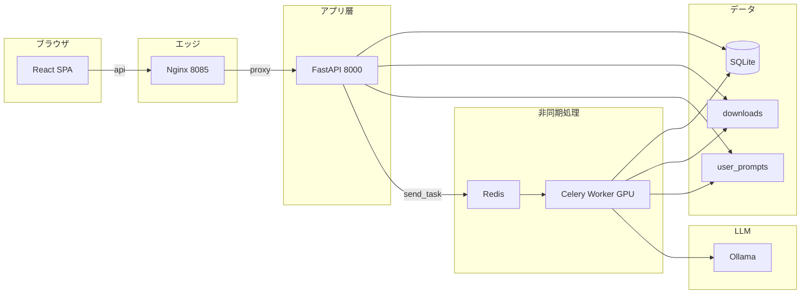

# フロントエンド／バックエンド分離 設計書

## 1. 目的とスコープ

- **目的**: UI（フロントエンド）と HTTP API・ジョブ投入（バックエンド）を分離し、開発・デプロイ・スケールの単位を明確にする。
- **スコープ**: 既存の Celery ワーカー（GPU・Whisper・LLM 処理）、SQLite（`database.py`）、プロンプト資産は維持し、**画面と REST API を追加**する。
- **非スコープ（現時点）**: 認証・多テナント、S3 等へのストレージ移行、PostgreSQL 化。

---

## 2. 論理アーキテクチャ

- **フロントエンド**: Vite + React + TypeScript。本番では Nginx が静的ファイルを配信し、`/api/*` を FastAPI にリバースプロキシする。
- **API サーバ**: FastAPI。DB 読み書き、ファイル受け取り、Celery タスク投入のみ。**Torch / Whisper を import しない**（軽量イメージ化のため）。
- **ワーカー**: 従来どおり `tasks.py`（`celery_app` にタスクを登録）。Redis 経由でジョブを受け取る。
- **共有ボリューム**: `data/`（DB・ユーザープロンプト一時）、`downloads/`（アップロード媒体）。

---

## 3. 物理構成（Docker Compose）

| サービス | イメージ / ビルド | 役割 |
|----------|-------------------|------|
| `frontend` | `Dockerfile.frontend` | Nginx + `frontend/dist`、`:8085` で公開 |
| `api` | `Dockerfile.api` | FastAPI（`requirements-api.txt` のみ） |
| `worker` | 既存 `Dockerfile` | GPU・Whisper・MoviePy・LLM 呼び出し |
| `redis` | `redis:alpine` | Celery ブローカー |
| （外部）Ollama | 運用側で別起動（例: `llm-net` 上） | ローカル LLM。Compose には含めず、ワーカーは `llm-net` ＋ `OLLAMA_BASE_URL` で接続 |

API とフロントは同一 Docker ネットワーク上で、`frontend` の Nginx が `http://api:8000` にプロキシする。

---

## 4. Celery の分離方針

### 4.1 問題

`tasks.py` は `faster_whisper` / `torch` 等を import するため、API から `from tasks import process_video_task` すると API コンテナも重い依存が必要になる。

### 4.2 解決

- **`celery_app.py`**: `Celery` インスタンスのみ定義（軽量）。
- **`tasks.py`**: `from celery_app import celery_app as app` の上で `@app.task` を定義。ワーカー起動時のみ読み込まれる重い import はこのファイルに残す。
- **API**: `from celery_app import celery_app` のみ import し、`celery_app.send_task("tasks.process_video_task", args=[...])` で投入。

タスク名はモジュール名 `tasks` と関数名から `tasks.process_video_task` となる（ワーカーが `-A tasks` で起動している前提）。

---

## 5. REST API 仕様（概要）

ベースパス: `/api`（本番は同一オリジンで `/api/...`、開発時は Vite が `localhost:8000` へプロキシ可）

| メソッド | パス | 説明 |
|----------|------|------|
| GET | `/api/health` | ヘルスチェック |
| GET | `/api/version` | `version.py` の版情報 |
| GET | `/api/presets` | `presets_builtin.json` の内容 |
| POST | `/api/tasks` | `multipart/form-data`: `metadata`（JSON 文字列）、`file`（必須）、任意で `prompt_extract` / `prompt_merge`（.txt） |
| GET | `/api/records` | クエリ: `days`, `search`, `category`, `status_filter` |
| GET | `/api/queue` | 待機・処理中レコード一覧 |
| GET | `/api/records/{task_id}` | 1 件取得（ポーリング用） |
| PATCH | `/api/records/{task_id}/summary` | 議事録本文の手動上書き `{ "summary": "..." }` |
| GET | `/api/records/{task_id}/export/minutes` | 議事録を `text/markdown` でダウンロード（長大本文用・data URL 回避） |
| GET | `/api/records/{task_id}/export/transcript` | 書き起こし全文を `text/plain` でダウンロード |

### 5.1 `POST /api/tasks` の `metadata`（JSON）

`backend/schemas.py` の `TaskSubmitMetadata` に対応。

- 通知: `notification_type` … `browser` | `webhook` | `none`（Webhook 時は `email` 必須）
- LLM: `llm_provider` … `ollama` | `openai`（OpenAI 時は `openai_api_key` 必須）
- 会議メタ: `topic`, `meeting_date`, `category`, `tags`, `preset_id`
- 精度用: `context` … `purpose`, `participants`, `glossary`, `tone`, `action_rules`

アップロードファイルは衝突回避のため API 側で `downloads/{task_id}_{元ファイル名}` に保存し、DB の `filename` には元の表示名を保存する。

---

## 6. フロントエンド設計

- **技術**: React 18、Vite 5、TypeScript、`react-markdown`（JSON でない要約の表示用）。
- **状態**: フォームはローカル state。ブラウザ通知用に `localStorage` キー `mm_pending_tasks` で `task_id` 一覧を保持し、10 秒間隔で `GET /api/records/{id}` をポーリング。
- **環境変数**: `VITE_API_BASE`（空なら相対パス `/api` — 本番 Nginx 配下で利用）。

---

## 7. セキュリティ・運用上の注意

- **API キー**: フロントから OpenAI キーを送る設計のため、**HTTPS 必須**の本番運用を推奨。社内 VPN 内のみの利用を前提とする。
- **認証**: 現状なし。外向き公開する場合は API キー、OAuth2、IP 制限などを別途設計すること。
- **CORS**: `CORS_ORIGINS` 環境変数（カンマ区切り）。開発時は `http://localhost:5173` を含める。
- **アップロード上限**: Nginx `client_max_body_size 2000m`（従来 Streamlit 設定に合わせた目安）。

---

## 8. レガシー（Streamlit）

- **`app.py`**: 引き続きリポジトリに残す。ローカルでは `streamlit run app.py` や従来どおり全量 `Dockerfile` で起動可能。
- **推奨**: 本番・新規運用は **React + FastAPI + Compose（frontend / api / worker）** を標準とする。

---

## 9. 開発フロー（ローカル）

1. Redis を起動（または Compose で redis のみ）。
2. プロジェクトルートで `pip install -r requirements-api.txt` → `uvicorn backend.main:app --reload --port 8000`。
3. `frontend/` で `npm install` → `npm run dev`（`/api` を Vite が 8000 にプロキシ）。
4. 別ターミナルで GPU ワーカー: `celery -A tasks worker --loglevel=info`（従来どおり `requirements.txt` フルセット）。

---

## 10. 今後の拡張候補

- OpenAPI クライアント生成（TypeScript）で型を API と完全同期
- JWT / Session によるログイン
- タスク結果の WebSocket / SSE プッシュ（ポーリング廃止）
- API とワーカーでオブジェクトストレージ経由のファイル受け渡し

---

## 11. 環境依存値の扱い（ハードコード方針）

- **コンテナ内のホスト名**（例: Compose の `redis`、`api`）は Docker のサービス名であり、**特定サーバーの固有名ではない**。Nginx の `proxy_pass http://api:8000` も同様。
- **ホストマシンや社内 DNS に依存する値**は可能な限り **環境変数**に寄せる:
  - API: `CORS_ORIGINS`（Compose では `MM_CORS_ORIGINS` から渡す）
  - ワーカー: `CELERY_BROKER_URL`、`OLLAMA_BASE_URL`、`WEBHOOK_URL`
  - CLI パイプライン: `OLLAMA_BASE_URL`、`OLLAMA_MODEL`（`pipeline/02_extract.py`、`03_merge.py`）
  - ローカル開発: リポジトリ直下 `.env` の `VITE_DEV_API_PROXY`（Vite が `/api` を転送する先）
- **既定値**（例: API の CORS に `localhost:5173`、Celery の `redis://localhost:6379/0`、ワーカーの `OLLAMA_BASE_URL=http://ollama-server:11434`）は **開発・Compose 向けのデフォルト**（`llm-net` 上の Ollama コンテナ名想定）であり、本番では `.env` やオーケストレーション側で上書きすること。

---

## 12. 変更履歴（ドキュメント）

| 版 | 日付 | 内容 |
|----|------|------|
| 1.0 | 2025-03-22 | 初版（FE/BE 分離、Compose、API 一覧、Celery 分離方針） |
| 1.1 | 2025-03-22 | 環境変数・ハードコード方針（§11） |
