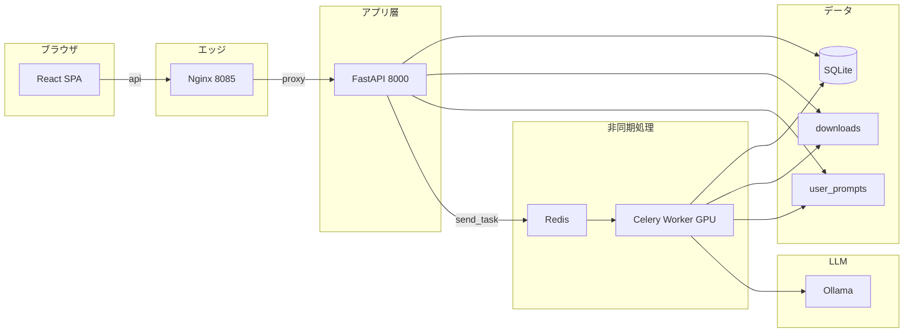

# フロントエンド／バックエンド分離 設計書

## 1. 目的とスコープ

- **目的**: UI（フロントエンド）と HTTP API・ジョブ投入（バックエンド）を分離し、開発・デプロイ・スケールの単位を明確にする。
- **スコープ**: 既存の Celery ワーカー（GPU・Whisper・LLM 処理）、SQLite（`database.py`）、プロンプト資産は維持し、**画面と REST API を追加**する。
- **非スコープ（現時点）**: 多テナントの厳密分離以外の大規模 IAM、S3 等へのストレージ移行、PostgreSQL 化。

---

## 2. 論理アーキテクチャ

- **フロントエンド**: Vite + React + TypeScript。本番では Nginx が静的ファイルを配信し、`/api/*` を FastAPI にリバースプロキシする。
- **API サーバ**: FastAPI。DB 読み書き、ファイル受け取り、Celery タスク投入のみ。**Torch / Whisper を import しない**（軽量イメージ化のため）。
- **ワーカー**: 従来どおり `tasks.py`（`celery_app` にタスクを登録）。Redis 経由でジョブを受け取る。
- **共有ボリューム**: `data/`（DB・ユーザープロンプト一時）、`downloads/`（アップロード媒体）。

---

## 3. 物理構成（Docker Compose）

| サービス | イメージ / ビルド | 役割 |
|----------|-------------------|------|
| `frontend` | `frontend/Dockerfile` | Nginx + `frontend/dist`、`:8085` で公開 |
| `api` | `Dockerfile.api` | FastAPI（`requirements-api.txt` のみ） |
| `worker` | 既存 `Dockerfile` | GPU・Whisper・MoviePy・LLM 呼び出し |
| `redis` | `redis:alpine` | Celery ブローカー |
| （外部）Ollama | 運用側で別起動（例: `llm-net` 上） | ローカル LLM。Compose には含めず、ワーカーは `llm-net` ＋ `OLLAMA_BASE_URL` で接続 |

API とフロントは同一 Docker ネットワーク上で、`frontend` の Nginx が `http://api:8000` にプロキシする。

---

## 4. Celery の分離方針

### 4.1 問題

`tasks.py` は `faster_whisper` / `torch` 等を import するため、API から `from tasks import process_video_task` すると API コンテナも重い依存が必要になる。

### 4.2 解決

- **`celery_app.py`**: `Celery` インスタンスのみ定義（軽量）。
- **`tasks.py`**: `from celery_app import celery_app as app` の上で `@app.task` を定義。ワーカー起動時のみ読み込まれる重い import はこのファイルに残す。
- **API**: `from celery_app import celery_app` のみ import し、`celery_app.send_task("tasks.process_video_task", args=[...])` で投入。

タスク名はモジュール名 `tasks` と関数名から `tasks.process_video_task` となる（ワーカーが `-A tasks` で起動している前提）。

---

## 5. REST API 仕様（概要）

ベースパス: `/api`（本番は同一オリジンで `/api/...`、開発時は Vite が `localhost:8000` へプロキシ可）

| メソッド | パス | 説明 |
|----------|------|------|
| GET | `/api/health` | ヘルスチェック |
| GET | `/api/version` | `version.py` の版情報 |
| GET | `/api/presets` | `presets_builtin.json` の内容 |
| POST | `/api/tasks` | `multipart/form-data`: `metadata`（JSON 文字列）、`file`（必須）、任意で `prompt_extract` / `prompt_merge`（.txt） |
| GET | `/api/records` | クエリ: `days`, `search`, `category`, `status_filter` |
| GET | `/api/queue` | 待機・処理中レコード一覧 |
| GET | `/api/records/{task_id}` | 1 件取得（ポーリング用） |
| PATCH | `/api/records/{task_id}/summary` | 議事録本文の手動上書き `{ "summary": "..." }` |
| GET | `/api/records/{task_id}/export/minutes` | 議事録を `text/markdown` でダウンロード（長大本文用・data URL 回避） |
| GET | `/api/records/{task_id}/export/transcript` | 書き起こし全文を `text/plain` でダウンロード |
| GET | `/api/auth/status` | `{ auth_required, bootstrap_needed, self_register_allowed }`（`MM_AUTH_SECRET` 未設定時は `auth_required: false`。`self_register_allowed` は 1 人目作成後かつ `MM_AUTH_SELF_REGISTER` 許可時に真） |
| POST | `/api/auth/bootstrap` | 初回のみ（registry のユーザー数が 0）。`{ email, password }` で最初の **管理者** を作成し JWT を返す |
| POST | `/api/auth/register` | ユーザーが 1 人以上いるとき、自己登録で **一般ユーザー** を追加し JWT を返す（`MM_AUTH_SELF_REGISTER=0` で無効） |
| POST | `/api/auth/login` | `{ email, password }` → JWT |
| GET | `/api/auth/me` | Bearer 必須（認証オフ時は `email: ""`）。`{ email, is_admin }` |
| GET | `/api/admin/users` | **管理者のみ**。ユーザー一覧（パスワードは含まない） |
| POST | `/api/admin/users` | **管理者のみ**。`{ email, password, is_admin }` でユーザ追加 |
| PATCH | `/api/admin/users/{login_email}/password` | **管理者のみ**。`{ new_password }`（`login_email` は URL エンコード） |
| PATCH | `/api/admin/users/{login_email}/role` | **管理者のみ**。`{ is_admin }`（最後の管理者の降格は不可） |
| DELETE | `/api/admin/users/{login_email}` | **管理者のみ**。自分自身・最後の管理者は不可 |

### 5.1 `POST /api/tasks` の `metadata`（JSON）

`backend/schemas.py` の `TaskSubmitMetadata` に対応。

- 通知: `notification_type` … `browser` | `webhook` | `none`（Webhook 時は `email` 必須）
- LLM: `llm_provider` … `ollama` | `openai`（OpenAI 時は `openai_api_key` 必須）
- 会議メタ: `topic`, `meeting_date`, `category`, `tags`, `preset_id`
- 精度用: `context` … `purpose`, `participants`, `glossary`, `tone`, `action_rules`

アップロードファイルは衝突回避のため API 側で `downloads/{task_id}_{元ファイル名}` に保存し、DB の `filename` には元の表示名を保存する。

---

## 6. フロントエンド設計

- **技術**: React 18、Vite 5、TypeScript、`react-markdown`（JSON でない要約の表示用）。
- **状態**: フォームはローカル state。ブラウザ通知用に `localStorage` キー `mm_pending_tasks` で `task_id` 一覧を保持し、10 秒間隔で `GET /api/records/{id}` をポーリング。
- **認証 UI**: `GET /api/auth/status` で `bootstrap_needed` が真のとき **初回セットアップ**（管理者・パスワード確認）→ `POST /api/auth/bootstrap`。それ以外は **ログイン** / **新規登録**タブ（`self_register_allowed` が真のとき）→ `POST /api/auth/login` または `POST /api/auth/register`。JWT は `localStorage`（`mm_auth_token`）。API 呼び出しは `Authorization: Bearer`。
- **右上アカウントメニュー**: ユーザーアイコンを押すとドロップダウンを表示。**メイン画面**では「設定」「サインイン／サインアウト」。認証かつ管理者のときは追加で「ユーザー・権限管理」。**初回セットアップ／ログイン画面**では「説明・設定」「フォームへ」（スクロール／フォーカス）。
- **設定ドロワー（右スライド）**: 「設定」で開く。認証時は **一般**タブにアカウント表示・OpenAI（サーバ保存キー）等。`is_admin` のときのみタブ **ユーザー・権限** を表示し、ユーザー一覧・追加・パスワード再設定・**管理者権限の付与・解除**・削除（API と同じ制約：最後の管理者は保護）を集約する。一般タブのアカウント欄に「管理者」と表示される場合がある。
- **環境変数**: `VITE_API_BASE`（空なら相対パス `/api` — 本番 Nginx 配下で利用）。**秘密をここに入れないこと**（後述 §7.2）。

---

## 7. セキュリティ・運用上の注意

- **API キー**: フロントから OpenAI キーを送る設計のため、**HTTPS 必須**の本番運用を推奨。社内 VPN 内のみの利用を前提とする。
- **認証**: `MM_AUTH_SECRET`（十分に長いランダム文字列）を設定すると JWT 認証が有効。初回は **ユーザー 0 件のときだけ** `POST /api/auth/bootstrap` または `MM_BOOTSTRAP_ADMIN_USER` / `MM_BOOTSTRAP_ADMIN_PASSWORD` で最初の管理者を作成可能。外向き公開する場合は HTTPS・IP 制限・WAF 等と併用すること。
- **CORS**: `CORS_ORIGINS` 環境変数（カンマ区切り）。開発時は `http://localhost:5173` を含める。LAN の IP でフロントにアクセスする場合は当該オリジンも列挙する。
- **アップロード上限**: Nginx `client_max_body_size 2000m`（従来 Streamlit 設定に合わせた目安）。

### 7.1 設定・秘密情報の「どこに書くか」（コード所在）

| 種別 | 主な読み取り元 | 備考 |
|------|----------------|------|
| JWT 署名鍵・トークン TTL・自己登録可否 | `backend/auth_settings.py`（`MM_AUTH_SECRET`, `MM_AUTH_TOKEN_HOURS`, `MM_AUTH_SELF_REGISTER`） | **秘密鍵はこのモジュール経由でサーバ内のみ**。クライアント JS に含めない。 |
| registry を使うか（認証の前提） | `database.py` の `_auth_secret_configured()`（`MM_AUTH_SECRET` の有無） | 上記と同じ環境変数を参照。 |
| CORS 許可オリジン | `backend/main.py`（環境変数 `CORS_ORIGINS`。Compose では `MM_CORS_ORIGINS` から注入） | 秘密ではないが、**許可先を広げすぎない**こと。 |
| 議事録保持日数などその他 | `database.py` 等（例: `MM_MINUTES_RETENTION_DAYS`） | サーバ環境変数。 |
| ホスト公開ポート・ブローカ URL | `docker-compose.yml`、`.env` / `.env.example` | **ポート番号自体は「秘密」ではない**が、不要なポートを外向きに開かない運用とセット。 |
| フロントの API ベース URL | ビルド時 `VITE_API_BASE` → `frontend/src/api.ts` の `PREFIX` | **公開してよい URL のみ**（後述）。 |

### 7.2 外部に出してはいけないもの（うっかり混入防止）

以下を **リポジトリのコミット・静的フロントのビルド成果物・公開スクリーンショット・サポート添付・ログ出力** に含めないこと。

| 対象 | 理由 | 典型の誤り |
|------|------|------------|
| `MM_AUTH_SECRET` | JWT 偽造・セッション乗っ取りに直結 | `.env` を git add する、`docker-compose.yml` のまま本番運用する、環境変数一覧をそのまま貼る |
| `MM_BOOTSTRAP_ADMIN_PASSWORD` | 初期管理者の乗っ取り | 同上 |
| ユーザーパスワード（平文） | そもそもサーバにも平文保存しない（bcrypt のみ） | ログにリクエストボディを出す |
| 利用者の OpenAI API キー（registry 保存分） | 第三者による課金・モデル悪用 | DB ファイルを無暗に配布、バックアップを公開領域に置く |
| Celery `WEBHOOK_URL` に含まれるシークレット付き URL | Webhook への不正 POST | 設定値をログに全文出力 |

**JWT（`localStorage` の `mm_auth_token`）**は署名鍵ではなく**トークン本体**である。秘密鍵と混同しないこと。XSS や共有端末では漏えいリスクがあるため、本番は HTTPS・CSP 等の一般的対策と併用する。

### 7.3 フロントエンド（Vite）で「出てよい情報」だけ

- `VITE_*` は **ビルド時にクライアント用 JS に埋め込まれる**と考える。API の**公開ベース URL**（例: 同一オリジンなら空）程度に留める。
- **`VITE_*` に `MM_AUTH_SECRET`・API キー・パスワードを渡さない。** 認証はログイン後の Bearer のみ。
- 開発時の `VITE_DEV_API_PROXY`（`vite.config.ts`）は開発サーバ用であり、本番 Nginx 配信の `dist` には乗らないが、**チーム共有の `.env` に本番秘密を書かない**運用にすること。

### 7.4 運用チェックリスト（リリース・公開前）

1. **本番**では `MM_AUTH_SECRET` を `openssl rand -hex 32` 等で**一意の長い値**にし、リポジトリ既定のフォールバック（Compose 未指定時の文字列）を使わない。
2. `.env` を **`.gitignore` 対象のまま**にし、秘密をコミットしない。
3. `MM_CORS_ORIGINS` は**実際に使うフロントのオリジンのみ**（ワイルドカードや過剰な `*` を避ける）。
4. API コンテナの **8000 をインターネットに直晒さない**（フロント Nginx 経由、またはリバースプロキシ後段のみ）。
5. スクリーンショット・インシデント報告に **Compose 画面・環境変数一覧・registry.db** が写り込まないよう注意する。

---

## 8. レガシー（Streamlit）

- **`app.py`**: 引き続きリポジトリに残す。ローカルでは `streamlit run app.py` や従来どおり全量 `Dockerfile` で起動可能。
- **推奨**: 本番・新規運用は **React + FastAPI + Compose（frontend / api / worker）** を標準とする。

---

## 9. 開発フロー（ローカル）

1. Redis を起動（または Compose で redis のみ）。
2. プロジェクトルートで `pip install -r requirements-api.txt` → `uvicorn backend.main:app --reload --port 8000`。
3. `frontend/` で `npm install` → `npm run dev`（`/api` を Vite が 8000 にプロキシ）。
4. 別ターミナルで GPU ワーカー: `celery -A tasks worker --loglevel=info`（従来どおり `requirements.txt` フルセット）。

---

## 10. 今後の拡張候補

- OpenAPI クライアント生成（TypeScript）で型を API と完全同期
- OAuth2 / SSO 連携
- タスク結果の WebSocket / SSE プッシュ（ポーリング廃止）
- API とワーカーでオブジェクトストレージ経由のファイル受け渡し

---

## 11. 環境依存値の扱い（ハードコード方針）

- **秘密情報の所在と流出防止**は **§7.1〜7.4** を正とする（本節はホスト名・URL のハードコード方針に限定する）。
- **コンテナ内のホスト名**（例: Compose の `redis`、`api`）は Docker のサービス名であり、**特定サーバーの固有名ではない**。Nginx の `proxy_pass http://api:8000` も同様。
- **ホストマシンや社内 DNS に依存する値**は可能な限り **環境変数**に寄せる:
  - API: `CORS_ORIGINS`（Compose では `MM_CORS_ORIGINS` から渡す）
  - ワーカー: `CELERY_BROKER_URL`、`OLLAMA_BASE_URL`、`WEBHOOK_URL`
  - CLI パイプライン: `OLLAMA_BASE_URL`、`OLLAMA_MODEL`（`pipeline/02_extract.py`、`03_merge.py`）
  - ローカル開発: リポジトリ直下 `.env` の `VITE_DEV_API_PROXY`（Vite が `/api` を転送する先）
- **既定値**（例: API の CORS に `localhost:5173`、Celery の `redis://localhost:6379/0`、ワーカーの `OLLAMA_BASE_URL=http://ollama-server:11434`）は **開発・Compose 向けのデフォルト**（`llm-net` 上の Ollama コンテナ名想定）であり、本番では `.env` やオーケストレーション側で上書きすること。

---

## 12. 変更履歴（ドキュメント）

| 版 | 日付 | 内容 |
|----|------|------|
| 1.0 | 2025-03-22 | 初版（FE/BE 分離、Compose、API 一覧、Celery 分離方針） |
| 1.1 | 2025-03-22 | 環境変数・ハードコード方針（§11） |
| 1.2 | 2026-03-23 | 初回セットアップ・ログイン・管理者 API／画面、`registry.users.is_admin`（§5・§6・§7） |
| 1.3 | 2026-03-23 | `POST /api/auth/register`・`self_register_allowed`・`MM_AUTH_SELF_REGISTER` |
| 1.4 | 2026-03-23 | 物理構成の `frontend/Dockerfile` 表記修正。§6 にアカウントドロップダウン・設定ドロワー「一般／ユーザー・権限」タブ・管理者権限 UI を反映 |
| 1.5 | 2026-03-23 | ログイン ID をメールに合わせ §5 認証 API を更新。**§7.1〜7.4** に設定・秘密のコード所在と外部流出防止を明記 |
