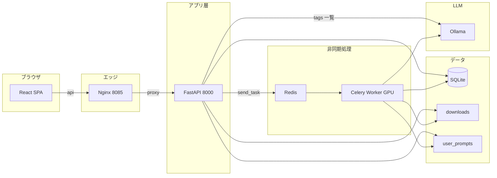

# フロントエンド／バックエンド分離 設計書

## 1. 目的とスコープ

- **目的**: UI（フロントエンド）と HTTP API・ジョブ投入（バックエンド）を分離し、開発・デプロイ・スケールの単位を明確にする。
- **スコープ**: 既存の Celery ワーカー（GPU・Whisper・LLM 処理）、SQLite（`database.py`）、プロンプト資産は維持し、**画面と REST API を追加**する。
- **非スコープ（現時点）**: 多テナントの厳密分離以外の大規模 IAM、S3 等へのストレージ移行、PostgreSQL 化。

---

## 2. 論理アーキテクチャ

- **フロントエンド**: Vite + React + TypeScript。本番では Nginx が静的ファイルを配信し、`/api/*` を FastAPI にリバースプロキシする。
- **API サーバ**: FastAPI。DB 読み書き、ファイル受け取り、Celery タスク投入のみ。**Torch / Whisper を import しない**（軽量イメージ化のため）。エンドポイントは **`backend/main.py`** でアプリを組み立て、**`backend/routes/`**（`meta` / `auth` / `admin` / `profile` / `presets` / `jobs` / `records`）に分割。共通処理は **`backend/ollama_client.py`**（Ollama の URL・**`/api/tags`**・**`try_ollama_unload_model`**）、**`backend/presets_io.py`**、**`backend/http_utils.py`** 等に集約。**Ollama 推論の `POST /api/generate`** は **API コンテナでは呼ばず**、**ワーカー `tasks.call_llm`** が **`requests`** で **`ollama_generate_url()`** へ送る。
- **ワーカー**: 従来どおり `tasks.py`（`celery_app` にタスクを登録）。Redis 経由でジョブを受け取る。
- **共有ボリューム**: `data/`（DB・ユーザープロンプト一時）、`downloads/`（アップロード媒体）。

---

## 3. 物理構成（Docker Compose）

| サービス | イメージ / ビルド | 役割 |
|----------|-------------------|------|
| `frontend` | `frontend/Dockerfile` | Nginx + `frontend/dist`、`:8085` で公開 |
| `api` | `Dockerfile.api` | FastAPI（`requirements-api.txt` のみ）。**`llm-net` 参加**・**`OLLAMA_BASE_URL`** で Ollama の **`/api/tags`** を呼び UI 用モデル一覧を返す。**`MM_OPENAI_ENABLED`** を API・ワーカーに注入 |
| `worker` | 既存 `Dockerfile` | GPU・Whisper・MoviePy・LLM 呼び出し |
| `redis` | `redis:alpine` | Celery ブローカー |
| （外部）Ollama | 運用側で別起動（例: `llm-net` 上） | ローカル LLM。Compose には含めず、ワーカーは `llm-net` ＋ `OLLAMA_BASE_URL` で接続 |

API とフロントは同一 Docker ネットワーク上で、`frontend` の Nginx が `http://api:8000` にプロキシする。

---

## 4. Celery の分離方針

### 4.1 問題

`tasks.py` は `faster_whisper` / `torch` 等を import するため、API から `from tasks import process_video_task` すると API コンテナも重い依存が必要になる。

### 4.2 解決

- **`celery_app.py`**: `Celery` インスタンスのみ定義（軽量）。
- **`tasks.py`**: `from celery_app import celery_app` の上で **`@celery_app.task`** を定義。ワーカー起動時のみ読み込まれる重い import はこのファイルに残す。
- **API**: `from celery_app import celery_app` のみ import し、`celery_app.send_task("tasks.process_video_task", args=[...])` で投入。

タスク名はモジュール名 `tasks` と関数名から `tasks.process_video_task` となる（ワーカーが `-A tasks` で起動している前提）。

### 4.3 `backend/` パッケージ構成（ルーティングと共通処理）

| モジュール | 役割 |
|------------|------|
| `main.py` | `FastAPI` 生成、**CORS**、**lifespan**、`routes` 各 `APIRouter` の `include_router` |
| `routes/meta.py` | `/api/health`, `/api/version`, `/api/ollama/models` |
| `routes/auth.py` | `/api/auth/*` |
| `routes/admin.py` | `/api/admin/*` |
| `routes/profile.py` | `/api/me/llm` |
| `routes/presets.py` | `/api/presets`（中身は `presets_io`） |
| `routes/jobs.py` | `POST /api/tasks` |
| `routes/records.py` | `/api/records`, `/api/queue`, 破棄・エクスポート・summary |
| `ollama_client.py` | **`OLLAMA_BASE_URL`** 解決、**`GET /api/tags`**（モデル名一覧）、**`/api/generate` の URL**（**`ollama_generate_url`**）、**`try_ollama_unload_model`**（**`keep_alive: 0`** の POST。VRAM 解放。**api** はタグ取得のみ、**tasks** が URL とアンロードを利用） |
| `presets_io.py` | `presets_builtin.json`（**api**・**tasks.py**・**Streamlit `app.py`** で共有） |
| `storage.py` | ユーザープロンプト一時ファイル（**api** の multipart と **Streamlit**） |
| `http_utils.py` | エクスポート用ヘッダ、SQLite 行の dict 化 |
| `passwords.py` | bcrypt パスワード検証（ログイン） |

---

## 5. REST API 仕様（概要）

ベースパス: `/api`（本番は同一オリジンで `/api/...`、開発時は Vite が `localhost:8000` へプロキシ可）

| メソッド | パス | 説明 |
|----------|------|------|
| GET | `/api/health` | ヘルスチェック |
| GET | `/api/ollama/models` | **`{ "models": string[] }`**。サーバが **`OLLAMA_BASE_URL`** の Ollama **`GET /api/tags`** を呼び、各エントリの **`name`**（なければ **`model`**）をソートして返す。ブラウザは Ollama に直アクセスしない。**認証不要**（モデル名は機密ではなく、未ログイン時も候補取得可能） |
| GET | `/api/version` | `version.py` の版情報 |
| GET | `/api/presets` | `presets_builtin.json` の内容（**`backend/presets_io.load_presets_dict`**、`routes/presets.py`） |
| POST | `/api/tasks` | `multipart/form-data`: `metadata`（JSON 文字列）、`file`（必須）、任意で `prompt_extract` / `prompt_merge`（.txt） |
| GET | `/api/records` | クエリ: `days`, `search`, `category`, `status_filter` |
| GET | `/api/queue` | 待機・処理中レコード一覧 |
| GET | `/api/records/{task_id}` | 1 件取得（ポーリング用） |
| PATCH | `/api/records/{task_id}/summary` | 議事録本文の手動上書き `{ "summary": "..." }` |
| GET | `/api/records/{task_id}/export/minutes` | 議事録を `text/markdown` でダウンロード（長大本文用・data URL 回避） |
| GET | `/api/records/{task_id}/export/transcript` | 書き起こし全文を `text/plain` でダウンロード |
| GET | `/api/auth/status` | **`AuthStatusResponse`**（`backend/schemas.py`）。`auth_required`, `bootstrap_needed`, `self_register_allowed` に加え **`email_notify_feature_enabled`**（`MM_EMAIL_NOTIFY_ENABLED`）、**`email_notify_available`**（上記 ON かつ SMTP 設定済み）、**`openai_enabled`**（`MM_OPENAI_ENABLED`）。`MM_AUTH_SECRET` 未設定時は `auth_required: false` ・他はフラグのみ意味を持つ |
| POST | `/api/auth/bootstrap` | 初回のみ（registry のユーザー数が 0）。`{ email, password }` で最初の **管理者** を作成し JWT を返す |
| POST | `/api/auth/register` | ユーザーが 1 人以上いるとき、自己登録で **一般ユーザー** を追加し JWT を返す（`MM_AUTH_SELF_REGISTER=0` で無効） |
| POST | `/api/auth/login` | `{ email, password }` → JWT |
| GET | `/api/auth/me` | Bearer 必須（認証オフ時は `email: ""`）。`{ email, is_admin }` |
| GET | `/api/admin/users` | **管理者のみ**。ユーザー一覧（パスワードは含まない） |
| POST | `/api/admin/users` | **管理者のみ**。`{ email, password, is_admin }` でユーザ追加 |
| PATCH | `/api/admin/users/{login_email}/password` | **管理者のみ**。`{ new_password }`（`login_email` は URL エンコード） |
| PATCH | `/api/admin/users/{login_email}/role` | **管理者のみ**。`{ is_admin }`（最後の管理者の降格は不可） |
| DELETE | `/api/admin/users/{login_email}` | **管理者のみ**。自分自身・最後の管理者は不可 |
| GET | `/api/me/llm` | ログインユーザーの OpenAI 設定の参照。**`{ openai_configured, openai_model, openai_feature_enabled }`**。認証オフ時はキー未設定扱い・モデルは既定文字列。**`MM_OPENAI_ENABLED` オフ**時は `openai_feature_enabled: false`（`openai_configured` も偽として扱う） |
| PATCH | `/api/me/llm` | **`{ openai_api_key?, openai_model? }`**。registry に保存。**`MM_OPENAI_ENABLED` オフ**のときは 400。認証オフ時は 400（サーバ保存不可） |
| POST | `/api/records/{task_id}/discard` | 待機・実行中ジョブの破棄。DB を cancelled、**Celery `revoke`（terminate）**、投入ファイル・ユーザープロンプト一時を削除 |

### 5.1 `POST /api/tasks` の `metadata`（JSON）

`backend/schemas.py` の `TaskSubmitMetadata` に対応。

- 通知: `notification_type` … `browser` | `webhook` | **`email`** | `none`（**Webhook** 時は **`email`** フィールド必須。**メール** 時は SMTP 未設定なら 503。認証かつ宛先空ならログイン ID のメールへ送る等、実装参照）
- LLM: `llm_provider` … `ollama` | `openai`
  - **`MM_OPENAI_ENABLED` オフ**のとき **`openai` は 400**（Ollama のみ）
  - **認証有効**かつ OpenAI: フォームのキーではなく **registry に保存された API キー**を使用。未保存なら 400
  - **認証オフ**かつ OpenAI: 従来どおりリクエストの **`openai_api_key`** 必須
- Ollama: **`ollama_model`** 文字列（ワーカーが `OLLAMA_BASE_URL` へ接続するときのモデル名）
- **Ollama 推論オプション（クライアント `metadata` では指定しない）**: ワーカー **`tasks.call_llm`**（Ollama 経路）が **`requests.post(ollama_generate_url(), …)`** で送る。**`options.num_ctx` は 4096 固定**（コード内）、**`timeout=600`** 秒。VRAM・KV 負荷抑制のための値であり、長会議では切り詰めが増える可能性あり。
- **Ollama VRAM 早期解放**: **`backend/ollama_client.try_ollama_unload_model`** を **`tasks._try_ollama_unload_for_config`** から呼ぶ。対象は **`_cleanup_after_cancel`**（処理途中の破棄）、**`fail()` によるエラー完了**、**`process_video_task` 外側の `except`**（いずれも OpenAI 経路ではスキップ）。**`process_video_task` 先頭で既に cancelled の早期 return**（Ollama 未使用想定）は **アンロードしない**。環境変数 **`OLLAMA_UNLOAD_ON_TASK_END`** が **`0` / `false` / `no`** のときはアンロード要求を送らない（既定はオン扱い）。
- **マージ LLM 失敗時**: **`call_llm` が例外**（タイムアウト等）のとき **`Merge failed (Error: …)` と抽出 JSON** を連結した文字列を **`summary`** にし、**`status` は `completed`** のまま（**このフォールバック経路では `try_ollama_unload` は呼ばない**。実装上の注意として、タイムアウト後も Ollama 側がモデル保持し続ける場合は **`OLLAMA_UNLOAD_ON_TASK_END`** 運用やサーバ側設定の検討対象）。
- 会議メタ: `topic`, `meeting_date`, `category`, `tags`, `preset_id`
- 精度用: `context` … `purpose`, `participants`, `glossary`, `tone`, `action_rules`

アップロードファイルは衝突回避のため API 側で `downloads/{task_id}_{元ファイル名}` に保存し、DB の `filename` には元の表示名を保存する。

---

## 6. フロントエンド設計

- **技術**: React 18、Vite 5、TypeScript、`react-markdown`（JSON でない要約の表示用）。
- **状態**: フォームはローカル state。ブラウザ通知用に `localStorage` キー `mm_pending_tasks` で `task_id` 一覧を保持し、10 秒間隔で `GET /api/records/{id}` をポーリング。**通知を使うユーザーは、ブラウザが出す通知許可のポップアップ／バナーで「許可」する**（ブロックのままでは通知が届かない）。
- **ジョブ破棄**: キュー表示などから **`POST /api/records/{task_id}/discard`**（`discardRecord`）を呼び、待機・処理中タスクを取消・ファイル掃除。
- **認証 UI**: `GET /api/auth/status` で `bootstrap_needed` が真のとき **初回セットアップ**（管理者・パスワード確認）→ `POST /api/auth/bootstrap`。それ以外は **ログイン** / **新規登録**タブ（`self_register_allowed` が真のとき）→ `POST /api/auth/login` または `POST /api/auth/register`。JWT は `localStorage`（`mm_auth_token`）。API 呼び出しは `Authorization: Bearer`。
- **右上アカウントメニュー**: ユーザーアイコンを押すとドロップダウンを表示。**メイン画面**では「設定」「サインイン／サインアウト」。認証かつ管理者のときは追加で「ユーザー・権限管理」。**初回セットアップ／ログイン画面**では「説明・設定」「フォームへ」（スクロール／フォーカス）。
- **設定ドロワー（右スライド）**: 「設定」で開く。認証時は **一般**タブにアカウント表示・**OpenAI（サーバ保存キー・モデル、`GET/PATCH /api/me/llm`）** 等。**`openai_enabled`（auth/status）が偽**のときは OpenAI 登録 UI を出さない（環境で `MM_OPENAI_ENABLED` オフ）。`is_admin` のときのみタブ **ユーザー・権限** を表示し、ユーザー一覧・追加・パスワード再設定・**管理者権限の付与・解除**・削除（API と同じ制約：最後の管理者は保護）を集約する。一般タブのアカウント欄に「管理者」と表示される場合がある。
- **Ollama モデル欄**: **初回マウント時と認証状態更新時（`authNonce`）のみ** **`GET /api/ollama/models`** で候補を取得（**ページ再読み込みで更新**。ウィンドウフォーカスや定期ポーリングは行わない）。**ネイティブ `<select>`** で候補のみ選択（手入力不可）。現在値が一覧に無い場合は先頭候補へ寄せる。
- **OpenAI オフ時の投入フォーム**: 「AI の接続先」は Ollama のみ表示。**OpenAI 用モデルプルダウンは表示しない**（未使用のため）。
- **マージのみ失敗した場合の議事録表示**: **`status` は `completed`**。本文は先頭が **`Merge failed (Error: …)`** で続けて **マージ前の抽出 JSON**（`react-markdown` で JSON として表示されない場合あり。生テキストとして閲覧）。
- **環境変数**: `VITE_API_BASE`（空なら相対パス `/api` — 本番 Nginx 配下で利用）。**秘密をここに入れないこと**（後述 §7.2）。

---

## 7. セキュリティ・運用上の注意

- **API キー**: フロントから OpenAI キーを送る設計のため、**HTTPS 必須**の本番運用を推奨。社内 VPN 内のみの利用を前提とする。
- **認証**: `MM_AUTH_SECRET`（十分に長いランダム文字列）を設定すると JWT 認証が有効。初回は **ユーザー 0 件のときだけ** `POST /api/auth/bootstrap` または `MM_BOOTSTRAP_ADMIN_USER` / `MM_BOOTSTRAP_ADMIN_PASSWORD` で最初の管理者を作成可能。外向き公開する場合は HTTPS・IP 制限・WAF 等と併用すること。
- **CORS**: `CORS_ORIGINS` 環境変数（カンマ区切り）。開発時は `http://localhost:5173` を含める。LAN の IP でフロントにアクセスする場合は当該オリジンも列挙する。
- **アップロード上限**: Nginx `client_max_body_size 2000m`（従来 Streamlit 設定に合わせた目安）。

### 7.1 設定・秘密情報の「どこに書くか」（コード所在）

| 種別 | 主な読み取り元 | 備考 |
|------|----------------|------|
| JWT 署名鍵・トークン TTL・自己登録可否 | `backend/auth_settings.py`（`MM_AUTH_SECRET`, `MM_AUTH_TOKEN_HOURS`, `MM_AUTH_SELF_REGISTER`） | **秘密鍵はこのモジュール経由でサーバ内のみ**。クライアント JS に含めない。 |
| registry を使うか（認証の前提） | `database.py` の `_auth_secret_configured()`（`MM_AUTH_SECRET` の有無） | 上記と同じ環境変数を参照。 |
| CORS 許可オリジン | `backend/main.py`（環境変数 `CORS_ORIGINS`。Compose では `MM_CORS_ORIGINS` から注入） | **ルートハンドラ**は `backend/routes/`。秘密ではないが、**許可先を広げすぎない**こと。 |
| 議事録保持日数などその他 | `database.py` 等（例: `MM_MINUTES_RETENTION_DAYS`） | サーバ環境変数。 |
| OpenAI 連携の ON/OFF | **`feature_flags.py`**（**`MM_OPENAI_ENABLED`**。`0` / `false` / `no` / `off` / 空でオフ。未設定時はオン＝後方互換） | API・ワーカー・Streamlit で共通。オフ時は `PATCH /api/me/llm` 不可・`POST /api/tasks` で `openai` 不可。 |
| API から Ollama への接続（タグ一覧・URL 解決） | **`backend/ollama_client.py`**（**`OLLAMA_BASE_URL`**、未設定時は `http://127.0.0.1:11434`）。呼び出しは **`routes/meta.py`** | Docker では **api を `llm-net` に参加**させ、ワーカーと同じ Ollama ホストを指定。**ワーカー**の推論 URL も同一モジュールで整合。 |
| Ollama 推論（`num_ctx`・タイムアウト） | **`tasks.call_llm`** → **`requests.post`**（**`backend/ollama_client.ollama_generate_url()`**）。**`num_ctx: 4096`**・**`timeout=600`**（コード固定。環境変数では切り替えない） | UI・`metadata` からは変更不可。**`pipeline/02_extract.py`**・**`03_merge.py`** は各自 **`OLLAMA_URL`**／**`NUM_CTX=4096`**・**`REQ_TIMEOUT=600`**（ワーカーと同趣旨）。**VRAM アンロード**: **`try_ollama_unload_model`**・**`OLLAMA_UNLOAD_ON_TASK_END`**（§5.1） |
| プリセット JSON の単一ソース | **`backend/presets_io.py`** | **`routes/presets.py`**・**`tasks.py`**・**Streamlit `app.py`** が同じ読み込み経路を使う。 |
| エクスポートヘッダ・行 dict 化 | **`backend/http_utils.py`** | **`routes/records.py`** で利用。 |
| ログイン時パスワード検証 | **`backend/passwords.py`** | **`routes/auth.py`** で利用。 |
| ユーザープロンプト一時保存 | **`backend/storage.py`** | **`routes/jobs.py`**（multipart）と **Streamlit `app.py`**（バイト列）が同じ保存規約を使う。 |
| メール通知（SMTP） | API・ワーカー双方に **`MM_SMTP_*`**（`MM_SMTP_HOST`, `MM_SMTP_FROM` 必須など。詳細は `.env.example`） | `email_notify_available` の判定とタスク検証に使用。 |
| ホスト公開ポート・ブローカ URL | `docker-compose.yml`、`.env` / `.env.example` | **ポート番号自体は「秘密」ではない**が、不要なポートを外向きに開かない運用とセット。 |
| フロントの API ベース URL | ビルド時 `VITE_API_BASE` → `frontend/src/api.ts` の `PREFIX` | **公開してよい URL のみ**（後述）。 |

### 7.2 外部に出してはいけないもの（うっかり混入防止）

以下を **リポジトリのコミット・静的フロントのビルド成果物・公開スクリーンショット・サポート添付・ログ出力** に含めないこと。

| 対象 | 理由 | 典型の誤り |
|------|------|------------|
| `MM_AUTH_SECRET` | JWT 偽造・セッション乗っ取りに直結 | `.env` を git add する、`docker-compose.yml` のまま本番運用する、環境変数一覧をそのまま貼る |
| `MM_BOOTSTRAP_ADMIN_PASSWORD` | 初期管理者の乗っ取り | 同上 |
| ユーザーパスワード（平文） | そもそもサーバにも平文保存しない（bcrypt のみ） | ログにリクエストボディを出す |
| 利用者の OpenAI API キー（registry 保存分） | 第三者による課金・モデル悪用 | DB ファイルを無暗に配布、バックアップを公開領域に置く |
| Celery `WEBHOOK_URL` に含まれるシークレット付き URL | Webhook への不正 POST | 設定値をログに全文出力 |

**JWT（`localStorage` の `mm_auth_token`）**は署名鍵ではなく**トークン本体**である。秘密鍵と混同しないこと。XSS や共有端末では漏えいリスクがあるため、本番は HTTPS・CSP 等の一般的対策と併用する。

### 7.3 フロントエンド（Vite）で「出てよい情報」だけ

- `VITE_*` は **ビルド時にクライアント用 JS に埋め込まれる**と考える。API の**公開ベース URL**（例: 同一オリジンなら空）程度に留める。
- **`VITE_*` に `MM_AUTH_SECRET`・API キー・パスワードを渡さない。** 認証はログイン後の Bearer のみ。
- 開発時の `VITE_DEV_API_PROXY`（`vite.config.ts`）は開発サーバ用であり、本番 Nginx 配信の `dist` には乗らないが、**チーム共有の `.env` に本番秘密を書かない**運用にすること。

### 7.4 運用チェックリスト（リリース・公開前）

1. **本番**では `MM_AUTH_SECRET` を `openssl rand -hex 32` 等で**一意の長い値**にし、リポジトリ既定のフォールバック（Compose 未指定時の文字列）を使わない。
2. `.env` を **`.gitignore` 対象のまま**にし、秘密をコミットしない。
3. `MM_CORS_ORIGINS` は**実際に使うフロントのオリジンのみ**（ワイルドカードや過剰な `*` を避ける）。
4. API コンテナの **8000 をインターネットに直晒さない**（フロント Nginx 経由、またはリバースプロキシ後段のみ）。
5. スクリーンショット・インシデント報告に **Compose 画面・環境変数一覧・registry.db** が写り込まないよう注意する。

---

## 8. レガシー（Streamlit）

- **`app.py`**: エントリのみ。`st.set_page_config`・`db.init_db`・サイドバー／メインのレイアウト呼び出しに留める。ローカルでは `streamlit run app.py` や従来どおり全量 `Dockerfile` で起動可能。
- **`streamlit_app/`**（`app.py` 専用の薄い UI 層）:
  | モジュール | 役割 |
  |------------|------|
  | `constants.py` | ロゴ SVG パス等 |
  | `styles.py` | `inject_ui_styles`（グローバル CSS） |
  | `render.py` | `render_minutes`・`render_error_hints`・`save_uploaded_prompts`（`backend.storage` への委譲） |
  | `task_status.py` | DB ステータス文字列 → 進捗バー用 `(percent, caption)` |
- **Python との共通化**: プリセット選択肢は **`backend.presets_io.preset_options_for_ui`**、カスタムプロンプト保存は **`backend.storage.save_uploaded_prompts`**（バイト列）を経由し、**React 経由の API** と同じファイルレイアウト・解釈に揃える。
- **推奨**: 本番・新規運用は **React + FastAPI + Compose（frontend / api / worker）** を標準とする。

---

## 9. 開発フロー（ローカル）

1. Redis を起動（または Compose で redis のみ）。
2. プロジェクトルートで `pip install -r requirements-api.txt` → `uvicorn backend.main:app --reload --port 8000`。
3. `frontend/` で `npm install` → `npm run dev`（`/api` を Vite が 8000 にプロキシ）。
4. 別ターミナルで GPU ワーカー: `celery -A tasks worker --loglevel=info`（従来どおり `requirements.txt` フルセット）。

---

## 10. 今後の拡張候補

- OpenAPI クライアント生成（TypeScript）で型を API と完全同期
- OAuth2 / SSO 連携
- タスク結果の WebSocket / SSE プッシュ（ポーリング廃止）
- API とワーカーでオブジェクトストレージ経由のファイル受け渡し

---

## 11. 環境依存値の扱い（ハードコード方針）

- **秘密情報の所在と流出防止**は **§7.1〜7.4** を正とする（本節はホスト名・URL のハードコード方針に限定する）。
- **コンテナ内のホスト名**（例: Compose の `redis`、`api`）は Docker のサービス名であり、**特定サーバーの固有名ではない**。Nginx の `proxy_pass http://api:8000` も同様。
- **ホストマシンや社内 DNS に依存する値**は可能な限り **環境変数**に寄せる:
  - API: `CORS_ORIGINS`（Compose では `MM_CORS_ORIGINS` から渡す）
  - API・ワーカー: **`OLLAMA_BASE_URL`**（API は **`/api/tags`**、ワーカーは推論）、**`MM_OPENAI_ENABLED`**
  - ワーカー: `CELERY_BROKER_URL`、`WEBHOOK_URL`
  - メール通知: **`MM_SMTP_*`**（API とワーカーで同一値を推奨）
  - CLI パイプライン: `OLLAMA_BASE_URL`、`OLLAMA_MODEL`（**`pipeline/02_extract.py`**・**`03_merge.py`**）。いずれも **`_ollama_generate_url()`** で URL を組み立て、**`num_ctx` 4096**・**タイムアウト 600 秒**（**`02_extract`** はペイロード内、**`03_merge`** は **`NUM_CTX` / `REQ_TIMEOUT`**）。**`extract_json_block`** は **`02_extract` 内の関数**（**`tasks.py` に同名関数**があり、ワーカーはそちらを使用。共通化モジュールはない）
  - ローカル開発: リポジトリ直下 `.env` の `VITE_DEV_API_PROXY`（Vite が `/api` を転送する先）
- **既定値**（例: API の CORS に `localhost:5173`、Celery の `redis://localhost:6379/0`、ワーカーの `OLLAMA_BASE_URL=http://ollama-server:11434`）は **開発・Compose 向けのデフォルト**（`llm-net` 上の Ollama コンテナ名想定）であり、本番では `.env` やオーケストレーション側で上書きすること。

### 11.1 GT-2222 HTTPS サブパス公開の確定運用

- 公開 URL は **`https://gt-2222/meetingminutesnotebook/`**（末尾スラッシュ推奨）。
- Compose の `.env`（`docker-compose.yml` と同階層）に以下を必ず設定する。
  - `VITE_BASE_PATH=/meetingminutesnotebook/`
  - `VITE_API_BASE=/meetingminutesnotebook`
  - `MM_CORS_ORIGINS` に `https://gt-2222` を含める（パスは書かない）。
- フロント配信 Nginx（`frontend/nginx.conf`）はサブパスを受けた際にプレフィックスを剥がして `/index.html`・`/assets` に解決する（`/meetingminutesnotebook/index.html` を直接探しに行かない）。
- デプロイスクリプト運用では次を既定とする。
  - `scripts/server-rebuild.sh` / `.bat`: `frontend` を `--no-cache` ビルド
  - `scripts/tar-scp.sh`: `TAR_SCP_SET_ENV=gt2222` で `config/gt-2222.env` を `.env` として配置可能
- **TLS（社内ルートCA + サーバ証明書）**
  - ホストNginxの `ssl_certificate` / `ssl_certificate_key` には **`gt-2222.crt`（CA署名）** と **`gt-2222.key`** を指定する（`rootCA.crt` はクライアント配布用。Nginx のサーバ証明書には使わない）
  - 同一 `server { listen 443 ssl; server_name GT-2222; }` 内の **全 `location`（例: `/jupyter/`）** は同じ証明書を共有する（`location` 単位で証明書は変えられない）
  - サーバ側確認: `openssl s_client` で **issuer がルートCA**、**SAN に `DNS:gt-2222`** であること
  - Windowsクライアント: **`rootCA.crt` を「信頼されたルート証明機関」に手動ストア指定**でインポート（ウィザードの「自動選択ストア」だけだと未信頼のままになりやすい）
  - **ブラウザ通知**利用時: 通知許可のポップアップ／バナーが出たら **許可**する（ブロックのままでは完了通知が届かない）
- 詳細な試行錯誤・切り分け手順は `document/gt2222_https_subpath_troubleshooting.md` を参照。

---

## 12. 変更履歴（ドキュメント）

| 版 | 日付 | 内容 |
|----|------|------|
| 1.0 | 2025-03-22 | 初版（FE/BE 分離、Compose、API 一覧、Celery 分離方針） |
| 1.1 | 2025-03-22 | 環境変数・ハードコード方針（§11） |
| 1.2 | 2026-03-23 | 初回セットアップ・ログイン・管理者 API／画面、`registry.users.is_admin`（§5・§6・§7） |
| 1.3 | 2026-03-23 | `POST /api/auth/register`・`self_register_allowed`・`MM_AUTH_SELF_REGISTER` |
| 1.4 | 2026-03-23 | 物理構成の `frontend/Dockerfile` 表記修正。§6 にアカウントドロップダウン・設定ドロワー「一般／ユーザー・権限」タブ・管理者権限 UI を反映 |
| 1.5 | 2026-03-23 | ログイン ID をメールに合わせ §5 認証 API を更新。**§7.1〜7.4** に設定・秘密のコード所在と外部流出防止を明記 |
| 1.6 | 2026-03-23 | **`GET /api/ollama/models`**、**`GET/PATCH /api/me/llm`**、**`POST .../discard`**。**`AuthStatus`** の **`email_notify_available` / `openai_enabled`**。**`MM_OPENAI_ENABLED`**・**`feature_flags.py`**・api の **`llm-net` / `OLLAMA_BASE_URL`**。§5.1 の通知・OpenAI 分岐。§6 の Ollama コンボボックス・OpenAI オフ UI。論理構成図に API→Ollama（tags） |
| 1.7 | 2026-03-23 | **`§4.3`** に `backend/` パッケージ・ルーター対応表を追加。**§7.1** の Ollama／プリセット／http_utils／passwords の所在を **`main.py` 単体記述から更新**。**§8** に Streamlit と `presets_io` / `storage` の共有を追記。**§2** 冒頭の API 説明は維持 |
| 1.8 | 2026-03-26 | **`§11.1`** に GT-2222 HTTPS サブパス公開の確定運用（`VITE_BASE_PATH`、`VITE_API_BASE`、`MM_CORS_ORIGINS`、frontend Nginx のプレフィックス剥がし、デプロイスクリプト運用）を追記 |
| 1.9 | 2026-03-26 | **`§11.1`** に TLS 運用（`gt-2222.crt`/`gt-2222.key`、`rootCA.crt` のクライアント手動ルート、同一443 `server` での証明書共有）を追記。`gt2222_https_subpath_troubleshooting.md` の証明書切り分けを拡充 |
| 1.10 | 2026-03-26 | **§6・§11.1** と `gt2222_https_subpath_troubleshooting.md` にブラウザ通知の許可ポップアップ運用を追記 |
| 1.11 | 2026-03-27 | **§8** に `streamlit_app/` パッケージ構成を追記（`app.py` の整理）。**`tasks.py`** は `celery_app` の冗長エイリアス削除と **`_assemble_prompt_with_context`** への抽出・統合 |
| 1.12 | 2026-03-27 | **§6** Ollama モデル候補は初回マウント・認証更新時のみ取得（ページ再読み込みで更新。フォーカス等での再取得なし） |
| 1.13 | 2026-03-27 | **`GET /api/ollama/models`** を**認証不要**に変更（認証 ON かつ未ログインで 401→一覧空になっていた問題の修正）。**§5** の応答説明を更新。**`ollama_client`** で tags の **`model`** キーにもフォールバック |
| 1.14 | 2026-03-27 | **§6** Ollama モデル UI を**コンボボックスから `<select>` のみ**に変更（手入力不可） |
| 1.15 | 2026-03-27 | **§5.1**・**§7.1**・**§11** に Ollama **`num_ctx: 4096`**（ワーカー `call_llm`）・**600 秒タイムアウト**、CLI **`pipeline/02_extract.py` / `03_merge.py`** との整合を追記（VRAM／KV 負荷・CPU オフロード抑制のため `8192` から変更） |
| 1.19 | 2026-03-28 | **コードに合わせて再同期**: **`GET /api/auth/status`** の拡張フィールド、**`ollama_client` と `tasks.call_llm` の役割分担**、**`try_ollama_unload_model` / `OLLAMA_UNLOAD_ON_TASK_END`**、**マージ失敗フォールバック**（`completed`・アンロード非呼び出し）、**`@celery_app.task`**、**`extract_json_block` は tasks と 02_extract に重複**（§2・§4.2・§4.3・§5・§5.1・§6・§7.1・§11） |
